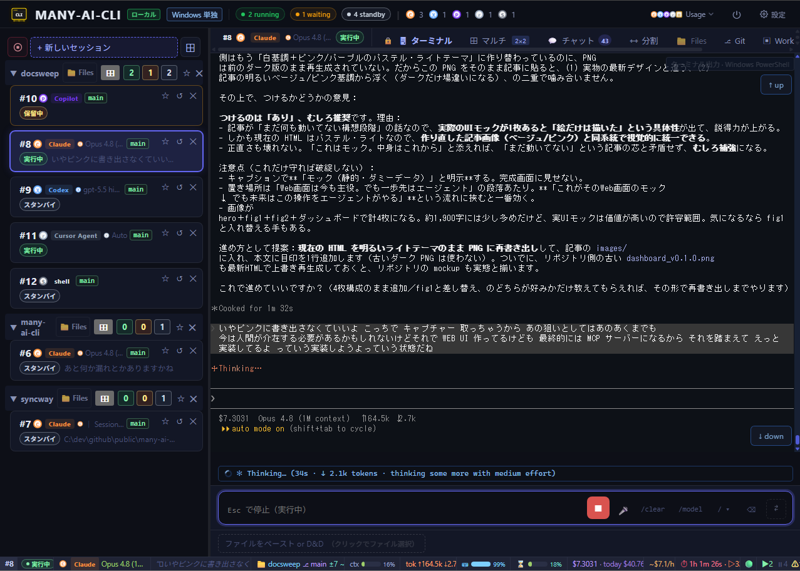

# many-ai-cli




**AI コーディング CLI の承認待ちを見逃さない。** `many-ai-cli` は Claude Code / Codex CLI / GitHub Copilot CLI / Cursor Agent CLI を監視し、承認が必要になった瞬間にデスクトップ／スマホへ通知します。ターミナルを見張り続ける必要はありません。あわせて、複数セッションの承認・監視・ターミナルを 1 画面の Web ダッシュボードで操作できます。

[English README](README.md)

---

## 概要

複数のターミナルで AI コーディング CLI を並列実行していると、どのセッションが承認待ちで止まっているか気づけず、ターミナルを何度も見にいくことになります。`many-ai-cli` は各 CLI を PTY でラップし、承認待ちを検出した瞬間にデスクトップ／スマホへ通知します。さらにブラウザの Hub UI で承認操作・進捗監視を一元的に行えます。CLI 本体の機能はそのままで、通知と承認 GUI を追加する設計です。

```
Terminal pane #1              Terminal pane #2
┌────────────────────┐        ┌────────────────────┐
│ many-ai-cli claude  │        │ many-ai-cli codex   │
│  (PTY 素通し)       │        │  (PTY 素通し)       │
└────────┬───────────┘        └────────┬───────────┘
         │ WebSocket                   │ WebSocket
         └─────────────┬───────────────┘
                       ▼
            ┌──────────────────┐
            │ many-ai-cli serve │  http://127.0.0.1:47777
            │  (Hub 常駐)       │
            └────────┬─────────┘
                     │
                     ▼
            ┌──────────────────┐
            │  ブラウザ Hub UI  │
            │  承認ポップオーバー│
            │  セッション一覧  │
            └──────────────────┘
```

各ペインでは対応プロバイダーのいずれか（`claude` / `codex` / `copilot` / `cursor-agent`）を実行できます。図では例として2つを示しています。

---

## 対応プロバイダー

`many-ai-cli` は以下の AI コーディング CLI を PTY でラップします（使うものは別途インストールしてください）:

| プロバイダー | サブコマンド | 備考 |
|---|---|---|
| Claude Code | `claude` | Anthropic |
| Codex CLI | `codex` | OpenAI |
| GitHub Copilot CLI | `copilot` | 公式 CLI。OAuth token / PAT / 認証情報は読み取り・保存・代理利用しません |
| Cursor Agent CLI | `cursor-agent` | 公式 CLI。事前にサインインが必要 |

**Ollama** は独立したラッパーではありません。`claude` または `codex` のラッパー経由で Ollama のモデルを使います（spawn フォームのモデルピッカーで **Ollama Cloud / Ollama Local** を選ぶと、Hub が Anthropic / OpenAI 互換エンドポイントを Ollama に向けます。「主な機能」の「モデルピッカー + Ollama route 自動切替」参照）。

Gemini CLI は意図的に対象外です。

---

## 主な機能

- **承認パネル統合**: Claude Code / Codex CLI / GitHub Copilot CLI / Cursor Agent CLI の承認待ちをブラウザ上のアクションバーで処理
- **複数質問の一括承認**: 1つの承認ブロック内の番号付き質問を選択し、まとめて PTY へ送信
- **リアルタイム PTY 表示**: xterm.js + WebSocket で CLI 出力を表示
- **チャット / 分割表示**: 会話ログを吹き出し形式で読み、検索・フィルタし、ライブターミナルと並べて表示
- **マルチタブ**: 複数の実行中セッションをグリッドで同時監視
- **Detached Session Grid**: AI / Shell セッションを別ブラウザウィンドウのグリッドビューに切り出す。承認・セッション管理は Hub が引き続き担当
- **Shell セッション**: PowerShell / bash / sh などの通常シェルを AI セッションと並べて Hub 管理下のセッションとして起動できる。承認 injection・Chat・トークンバーなど AI 固有機能は Shell セッションでは自動的に無効化される
- **Files タブ**: プロジェクトファイルをツリー表示し、Markdown / コードのプレビュー、パスコピー、フォルダ作成、競合検出付き保存、リネーム、移動、空フォルダ削除を実行
- **Git ビュー**: ブランチ履歴、commit 詳細、変更ファイル、diff、fetch、`git pull --ff-only` を checkout なしで実行
- **Commit all**: 明示的な Review 後に working tree 全体を `git add -A` してローカル commit（push は実行しません）
- **Workbench タブ**: 保存済みセッション履歴、タイムライン、要約、redact 済み export、prompt template、task/policy メモ、diagnostics、usage 集計、stale session、worktree helper を扱う
- **ファイル / 画像添付**: ファイルや画像の paste / D&D からローカル保存し、セッションへパスを inject
- **音声入力**: ブラウザ内蔵認識またはローカル Whisper でプロンプトを入力（Windows x64 では Whisper 管理インストール対応）
- **PWA + opt-in Web Push**: Hub をローカル Web アプリとしてインストールし、Settings で明示的に有効化した場合だけ承認待ち通知を受け取る
- **承認検出パターン profile**: GitHub から同期する公式 trigger phrase と、ユーザー編集用 custom profile を分離
- **サーバ側ユーザー設定**: 音声、通知音、お気に入り、セッション順、spawn 既定、アバター設定を `config.yaml` に保存
- **UI からの新規セッション spawn**（`/api/spawn`）
- **モデルピッカー + Ollama route 自動切替**: spawn フォームから Anthropic / OpenAI / Ollama Cloud / Ollama Local のモデルを選択でき、Hub が必要な `ANTHROPIC_*` / `OPENAI_*` 環境変数をセッションごとに自動注入（shell での事前設定不要）
- **統合ランチャー（Windows / Linux / macOS）**: `many-ai-cli-launcher` で接続プロファイルから Hub へ接続し既定ブラウザで操作。SSH `serve` / `tunnel` プロファイルは全 OS、WSL プロファイルは Windows で WSL 内に Hub を起動
- **リモートサーバー / Docker 運用資材**: GHCR image、ユーザー別コンテナ、loopback 限定公開、自動更新スクリプトでサーバー運用
- **クリーン transcript 生成**: 人間が読める `.txt` を自動生成し、`log-clean` で手動再生成も可能
- **言語切替**（英語 / 日本語）
- **ローカル限定**: Hub は `127.0.0.1` のみに bind。`many-ai-cli` 自身はテレメトリを送信しません
- **リモートアクセス保護**: 設定の「リモートアクセス保護」から、token と認証 cookie を一括再生成する**全アクセス失効**（紛失時のキルスイッチ）、非 loopback アクセス時のみ要求する**任意 PIN**（既定 OFF・ロックアウト付き）、**新規デバイス接続の通知**が使えます

---

## 動作要件

| 項目 | 要件 |
|---|---|
| Go | 1.25 以上（ビルド時） |
| OS | Windows 10/11、macOS、Linux |
| ブラウザ | Chrome / Edge / Firefox / Safari |
| AI CLI | Claude Code、Codex CLI、GitHub Copilot CLI、Cursor Agent CLI（使う provider は別途インストール済みであること） |

### v0.3.0 の検証状況

- 実機で動作検証済み: Windows ローカル Hub、Windows 統合ランチャー（`wsl` / SSH tunnel profile）
- 実機で十分に未検証: ネイティブ Linux / ネイティブ macOS

Linux / macOS でも動作する想定ですが、v0.3.0 時点では実機での十分な検証は未実施です。
ご利用の際はご了承ください。問題があれば Issue で報告してください。

---

## クイックダウンロード

### パッケージマネージャでインストールする場合

**開発者向けインストール（npm registry・推奨）:**

```powershell
pnpm add -g many-ai-cli
```

フォールバック（同じ registry。手元にあるものを使ってください）:

```powershell
bun install -g many-ai-cli
npm install -g many-ai-cli
```

> `many-ai-cli` v0.3.0 が npm registry に公開され次第、利用可能になります。各プラットフォーム向けの Go ネイティブバイナリを optional dependency として同梱するため、ブラウザでのダウンロードは発生せず、起動 shim はインストール時にローカル生成されるので Mark-of-the-Web が付かず、その SmartScreen トリガーを回避できます。これは Authenticode 署名の代替ではありません（Smart App Control / WDAC / AppLocker / EDR / ウイルス対策のポリシーは別問題）。インストール後にグローバルコマンドが見つからない場合は `pnpm setup` を実行する（またはシェルを開き直す）と、グローバル bin ディレクトリが `PATH` に載ります。

**Windows (winget):**

```powershell
winget install ishizakahiroshi.many-ai-cli
```

> 初回の winget manifest PR が `microsoft/winget-pkgs` にマージされてから利用可能になります。それまでは下記の zip ダウンロードを使ってください。
> Windows では、利用可能になり次第 package manager 経由を推奨します。ブラウザで zip / exe を直接ダウンロードする導線に比べ、Mark-of-the-Web 起因の警告に入りにくくなります。ただし Authenticode コード署名や組織の許可リスト登録の代替ではありません。

**macOS (Homebrew):**

```bash
brew install --cask ishizakahiroshi/tap/many-ai-cli
```

**Linux — Debian / Ubuntu (.deb)・RHEL 系 (.rpm):**

リリースページからパッケージをダウンロードして:

```bash
sudo dpkg -i many-ai-cli_<version>_amd64.deb   # Debian / Ubuntu
sudo rpm -i many-ai-cli-<version>.x86_64.rpm   # RHEL 系
```

### 手動ダウンロード（全プラットフォーム）

最新リリースを [GitHub Releases](https://github.com/ishizakahiroshi/many-ai-cli/releases/latest) から取得します。

| プラットフォーム | ダウンロード |
|----------|----------|
| Windows (x64) | `many-ai-cli-<version>-windows-x64.zip` |
| macOS (Intel) | `many-ai-cli-<version>-macos-intel.zip` |
| macOS (Apple Silicon) | `many-ai-cli-<version>-macos-apple-silicon.zip` |
| Linux (x64) | `many-ai-cli-<version>-linux-x64.zip` |

> 設定・ログは `~/.many-ai-cli/`（初回起動時に作成）に保存されます。
> セッションログにはユーザー入力・AI 出力が保存されます。機密情報として扱ってください。

### Windows のセキュリティ警告について

現在の Windows 向けリリースバイナリは Authenticode コード署名されていません。
`SHA256SUMS.txt` はリリース成果物の完全性確認用に署名されていますが、`.exe` 本体のコード署名ではありません。
Windows のブロックには複数の種類があります。

- **Mark-of-the-Web**: ダウンロードした zip / exe にインターネット由来の印が付くことで警告される場合があります。Windows zip を展開した後、展開先フォルダで `unblock-windows.cmd` を実行してください。このスクリプトは同じフォルダの `many-ai-cli*.exe` だけに PowerShell `Unblock-File` を実行します。管理者権限は不要で、システムポリシーを永続変更せず、アプリも自動起動しません。
- **SmartScreen**: 未知の発行元・利用実績の少ないアプリとして警告される場合があります。自分で公式リリースから取得し、必要に応じてチェックサム / 署名を確認した場合だけ続行してください。
- **Smart App Control**: Windows 11 の一部環境では、未署名アプリが完全にブロックされる場合があります。`unblock-windows.cmd` では回避できません。未署名 `.exe` 配布のままでは、このケースに対するサポート済み回避策はありません。
- **組織管理ポリシー**: 会社 PC などでは AppLocker / WDAC / EDR / ウイルス対策ソフト等により、上記とは別にブロックされる場合があります。これらを無効化せず、組織の許可リスト登録手順に従ってください。

winget が利用可能な場合、Windows では手動 zip より winget を優先してください。
手動 zip は、リリース成果物を直接取得したいユーザー向けに引き続きサポートします。
Hub 自体は `127.0.0.1` のみに bind するため、通常のローカル利用で LAN にサーバーを開いたり、公開用の Windows Firewall 例外を追加したりする必要はありません。

Windows zip の推奨手順:

1. GitHub Releases から `many-ai-cli-<version>-windows-x64.zip` をダウンロードする
2. 必要に応じて `SHA256SUMS.txt` / cosign 署名を検証する
3. zip を展開する
4. `unblock-windows.cmd` を実行する
5. `many-ai-cli.exe` または `many-ai-cli-launcher.exe` を手動で起動する

### リリース成果物の検証（チェックサム + 署名）

`v0.1.2` 以降の正式リリースには以下が含まれます。

- `SHA256SUMS.txt`
- `SHA256SUMS.txt.sig`
- `SHA256SUMS.txt.pem`

1. `SHA256SUMS.txt` の署名を検証:

```bash
cosign verify-blob \
  --certificate SHA256SUMS.txt.pem \
  --signature SHA256SUMS.txt.sig \
  --certificate-identity-regexp "https://github.com/ishizakahiroshi/many-ai-cli/.github/workflows/release.yml@refs/tags/v.*" \
  --certificate-oidc-issuer "https://token.actions.githubusercontent.com" \
  SHA256SUMS.txt
```

2. ダウンロードしたバイナリをチェックサムで検証:

```bash
sha256sum -c SHA256SUMS.txt
```

---

## クイックスタート（推奨）

通常はこれだけです。CLI を直接叩く必要はありません。

1. リリースページから自分の OS 向け zip をダウンロードして展開する
2. **`many-ai-cli.exe` をダブルクリックして起動する**（または引数なしで `many-ai-cli` を実行）
   - Hub が起動し、ブラウザが自動で開きます（`http://127.0.0.1:47777/?token=<token>`）
   - すでに Hub が起動済みの場合は、ブラウザを開くだけで終了します
3. ブラウザの Hub UI 左下の **「+ 新しいセッション」** をクリックし、使う AI CLI のセッションを起動する
4. セッションが UI に表示されれば運用開始。承認待ちが発生すると入力欄の下にアクションバーが出るので、クリックまたはキーボードで操作する

ターミナルを別途開かなくても、セッションの起動・操作・承認はすべて Hub UI から行えます。

> **⚠ コンソールウィンドウについて**
> `.exe` を起動すると黒いコンソールウィンドウがブラウザと一緒に開きますが、**これが Hub サーバの実体プロセスです**。ウィンドウを `×` で閉じると Hub が終了します（邪魔な場合は閉じずに **最小化** してください）。
> なお Hub が落ちた場合でも、走行中の AI セッションはデフォルトで **60 分間 Hub の復帰を待つ**ようになっています（`config.yaml` で 0–86400 秒 = 最大 24 時間まで変更可、長時間タスクを走らせる場合は伸ばせます）。間に合わなければ自動で終了するので、Web UI 側のバグや再起動で AI 作業が即座に道連れにはなりません。詳細は「[シャットダウン・ゾンビセッション対策・Hub クラッシュ耐性](#シャットダウンゾンビセッション対策hub-クラッシュ耐性)」を参照してください。
> Hub を意図的に停止するときは、Hub UI 右上の `⏻` ボタン、または別ターミナルで `many-ai-cli stop` を使ってください。

### 統合ランチャー（Windows / Linux / macOS）

`many-ai-cli-launcher`（Windows では `many-ai-cli-launcher.exe`）は WSL とリモートサーバー（SSH）の両方を対象に接続プロファイルを管理できる統合ランチャーです。プロファイルは `~/.many-ai-cli/launcher-profiles.yaml` に保存されます。

ランチャーバイナリは全 OS 向けに配布されます。`ssh` プロファイル（`serve` / `tunnel`）は Windows / Linux / macOS のいずれでも動作します。`wsl` プロファイルは Windows 専用で、他 OS では明示的にエラーを返します。ブラウザは Linux では `xdg-open`、macOS では `open` で開きます。

#### 仕組み

保存したプロファイルをもとに接続先 Hub へ繋ぎ（必要な場合は Hub を起動し）、ブラウザを自動で開きます。プロファイルの種別は 2 つです。

| 種別 | 用途 |
|---|---|
| `wsl` | WSL 内で `many-ai-cli serve` を起動し、Windows ブラウザで開く（Windows 専用） |
| `ssh` | リモートサーバー（自宅サーバーや借りた Linux マシン等）へ SSH 経由で接続する（全 OS 対応） |

`ssh` 種別にはさらに 2 つのモードがあります。

| モード | 用途 |
|---|---|
| `serve` | リモートサーバーに SSH してリモート側で `many-ai-cli serve` を起動する |
| `tunnel` | リモート側ですでに起動中の常駐 Hub（systemd / tmux / Docker compose 等で立てっぱなしにした Hub）へポートフォワードする |

どちらのモードでも、リモートの Hub は `127.0.0.1` にのみ bind したままです。SSH のローカルフォワード（`-L 127.0.0.1:<port>:127.0.0.1:<port>`）によって Hub をネットワークに公開することなく Windows ブラウザから到達可能にします。

`wsl` プロファイルは内部で `wsl.exe` を呼び出し、WSL 内の Linux バイナリ（`many-ai-cli serve`）を立ち上げます。Linux 側が Hub URL を標準出力へ出力した時点で Windows の既定ブラウザが自動的に開きます。WSL 内では `bash -ilc`（ログインシェル + インタラクティブ）で起動するため、`~/.bashrc` に書かれた `nvm` / `pnpm` / `cargo` 等の PATH 設定がそのまま有効になります。Windows 側でポートが衝突している場合（`many-ai-cli.exe` がすでに 47777 を使用中など）、ランチャーは空きポートを自動的に選択します。

#### セットアップ

ランチャーバイナリは各 OS のリリースアーカイブに本体バイナリと並んで同梱されています（deb/rpm/Homebrew パッケージにも含まれます）。Windows では `many-ai-cli-<version>-windows-x64.zip` を展開して `many-ai-cli-launcher.exe` を PATH の通った場所に置きます。Linux/macOS では各プラットフォームのアーカイブから `many-ai-cli-launcher` を取り出す（またはパッケージマネージャでインストールする）して PATH に置きます。

`~/.many-ai-cli/launcher-profiles.yaml` を作成します。

```yaml
version: 1
profiles:
  # WSL プロファイル — WSL 内で Hub を起動する
  - name: my-wsl
    type: wsl
    distro: Ubuntu-22.04  # 省略 = wsl.exe の既定ディストリビューション
    hub_port: 0           # 0 = Windows 側衝突を避けて自動選択

  # リモートサーバープロファイル（serve モード）— SSH してリモートで many-ai-cli serve を起動
  - name: my-remote
    type: ssh
    mode: serve
    host: remote.example.com
    user: your-user
    hub_port: 47777

  # リモートサーバープロファイル（tunnel モード）— 常駐させた Hub（systemd / tmux / Docker いずれでも）へポートフォワード
  - name: remote-docker
    type: ssh
    mode: tunnel
    host: remote.example.com
    user: your-user
    hub_port: 47801
    token_command: "docker exec many-ai-cli-user1 sh -c 'grep ^token ~/.many-ai-cli/config.yaml | cut -d\" \" -f2'"
```

#### WSL プロファイルの前提: WSL 側に Linux バイナリを配置

`wsl` プロファイルを使うには、WSL 内の PATH が通った場所に Linux 版 `many-ai-cli` バイナリが必要です。リリースページから `many-ai-cli-<version>-linux-x64.zip` をダウンロードして展開し、配置します。

```bash
unzip many-ai-cli-<version>-linux-x64.zip

# ~/.local/bin を使う場合（ユーザーローカル、sudo 不要）
mkdir -p ~/.local/bin
mv many-ai-cli ~/.local/bin/many-ai-cli
chmod +x ~/.local/bin/many-ai-cli

# ~/.local/bin が PATH に含まれているか確認
echo $PATH | grep -q "$HOME/.local/bin" && echo "OK" || echo "~/.local/bin を PATH に追加してください"
```

`~/.local/bin` が PATH に入っていない場合は `~/.bashrc` に追記します。

```bash
# ~/.bashrc に追記
export PATH="$HOME/.local/bin:$PATH"
```

システム全体に置く場合（sudo 必要）:

```bash
sudo mv many-ai-cli /usr/local/bin/many-ai-cli
sudo chmod +x /usr/local/bin/many-ai-cli
```

WSL 内で動作確認:

```bash
many-ai-cli --version
```

#### tunnel モード: 最初から最後までの流れ

`tunnel` モードは、リモートで動き続ける Hub に接続する方式です。ランチャーの窓を閉じても切れるのは SSH トンネルだけで、Hub と AI セッションは動き続けます。次回接続すれば前回の続きからそのまま再開できます。ゼロからの手順は以下のとおりです。

**A. リモート側の準備（最初に 1 回だけ）**

1. Linux 版 `many-ai-cli` バイナリをリモートマシンに配置し、実行権限を付けます。
2. **ポートを固定して** Hub を起動し、常駐させます（tunnel モードではポート自動選択は使えません）。常駐方法は systemd / tmux・screen / Docker のいずれでも構いません。

   ```bash
   many-ai-cli serve --port 47777
   ```

   初回起動時にアクセス用トークンが自動生成され、`~/.many-ai-cli/config.yaml` の `token:` に保存されます。
3. そのトークンを出力するコマンドを決めます（プロファイルの `token_command` になります）。例：

   ```bash
   awk '/^token:/{print $2}' ~/.many-ai-cli/config.yaml
   ```

   SSH 経由で一度実行し、トークン文字列が 1 行返ることを確認してください。

**B. Windows 側の準備（最初に 1 回だけ）**

4. SSH の**鍵認証**を設定します。ランチャーは `ssh.exe` を `-o BatchMode=yes`（対話入力禁止）で実行するため、パスワード認証は使えません。`ssh ユーザー名@ホスト` がパスワード入力なしで通る状態にしてください。
5. プロファイルを作成します。ランチャーの UI（種別: SSH / モード: tunnel）でも、`launcher-profiles.yaml` の直接編集でも構いません。

   | 項目 | 値 | 必須 |
   |---|---|---|
   | `name` | 任意の名前 | ○ |
   | `type` | `ssh` | ○ |
   | `mode` | `tunnel` | ○ |
   | `host` | リモートの IP / ホスト名 | ○ |
   | `user` | SSH ログインユーザー（空欄 = ssh 既定） | — |
   | `ssh_port` | 22 以外なら指定（0 = 既定） | — |
   | `identity_file` | 空欄 = 既定鍵 / agent | — |
   | `hub_port` | 手順 2 のポート番号（例: `47777`）。必ず一致させる | ○ |
   | `token_command` | 手順 3 のコマンド | ○ |

**C. 日常の利用（毎回）**

1. ランチャーを起動してプロファイルを選ぶと、トンネル確立 → `token_command` でトークン取得 → Hub の応答確認 → ブラウザ表示まで自動で進みます。
2. あとは Hub UI で普段どおり操作します（セッション spawn・承認など）。
3. 終わるときはランチャーの窓を閉じるだけ。切れるのはトンネルだけで、リモートのセッションは動き続けます。
4. 次回は同じプロファイルで接続すれば、前回の続きに入れます。

**つまずきやすい点**

- **ポート不一致** — リモートの `serve --port` とプロファイルの `hub_port` は同じ番号にする必要があります。
- **パスワードを聞かれる状態** — BatchMode で即失敗します。鍵認証が必須です。
- **`token_command` の出力が空** — リモートで Hub を一度も起動していないと `config.yaml` にトークンがありません。先に手順 2 を済ませてください。
- **Docker で動かす場合** — コンテナの Hub ポートをホスト側の `127.0.0.1` に公開しておく必要があります（トンネルの終点はリモートマシンの `127.0.0.1:<hub_port>` です）。

#### 起動

```powershell
many-ai-cli-launcher.exe                    # プロファイル 1 件なら即接続。複数なら選択画面を表示
many-ai-cli-launcher.exe --profile my-remote  # 指定プロファイルで接続
many-ai-cli-launcher.exe --last            # 前回使ったプロファイルで接続
many-ai-cli-launcher.exe --ui             # 常に選択画面を表示
```

#### セキュリティ前提

ランチャーを使っても Hub のセキュリティモデルは変わりません。

- Hub はリモート側でも `127.0.0.1` にのみ bind し続けます（`0.0.0.0` バインドやリバースプロキシ経由の公開はしません）
- SSH フォワードは `127.0.0.1` 同士のローカルフォワードのみ使用します（`-g` や `GatewayPorts` は不使用）
- パスワード・鍵のパスフレーズは保存しません。鍵認証が必要です（`-o BatchMode=yes` で対話を禁止）
- `token_command` で取得したトークンは現在のセッション中のみ使用し、`launcher-profiles.yaml` には書き込みません

プロファイルの全フィールドと接続フローの詳細は [docs/v0.3.x-many-ai-cli-design.md — §13](docs/v0.3.x-many-ai-cli-design.md) を参照してください。

#### Windows がランチャーをブロックする場合: ローカル `.exe` なしでリモートサーバーに接続

Windows SmartScreen や会社 PC のポリシーで `many-ai-cli-launcher.exe` を実行できない場合でも、Windows 側で many-ai-cli の exe を一切動かさずにリモートサーバー上の Hub へ接続できます。この導線で Windows 側が使うものは次の 2 つだけです。

- Windows 標準の OpenSSH client（`ssh.exe`）
- 普段使っているブラウザ

`many-ai-cli` 本体と provider CLI（`claude` / `codex` / `copilot` / `cursor-agent`）はリモートサーバー側で動かします。ランチャーほど自動ではありませんが、SSH トンネル用のウィンドウを 1 つ開いたままにして、ブラウザで Hub URL を開くだけです。

**SmartScreen ダイアログを避けるより簡単な導線**

ターミナル（`CreateProcess` 経由）からの起動は Explorer の評価チェックを通らないため、SmartScreen の「Windows によって PC が保護されました」ダイアログは基本的に出ません。本体 `many-ai-cli` バイナリだけで完結し、`many-ai-cli-launcher.exe` をダブルクリックせずに済む導線が 2 つあります。

- **Hub の 🖥 Server ボタン** — `many-ai-cli serve`（または通常どおり Hub 起動）後、ダッシュボードのヘッダーにある **🖥 Server** をクリック。プロファイル一覧の接続/切断/追加ができ、接続成功で対象 Hub が新しいタブで開きます。SSH/WSL の子プロセスは Hub 自身が抱えるため、余分なコンソール窓は残りません。
- **`many-ai-cli connect`** — `many-ai-cli connect --profile <名前>`（または `--last`）で、ランチャーと同じ接続フローをターミナルから直接実行します。

それでも SmartScreen の*ダイアログ*（実ウイルス検知ではない）が出る場合は、まず Mark-of-the-Web を解除してください。展開フォルダの `unblock-windows.cmd` を実行するか、PowerShell の `Unblock-File` でバイナリを解除します。これは評価ダイアログを消すだけで、Microsoft Defender が実際に隔離した場合（Go バイナリは誤検知され得る）は署名・除外設定・誤検知報告が別途必要です。パッケージマネージャ経由で導入すればバイナリはローカル生成のため Mark-of-the-Web 自体が付きません。

**どの設定がどこに保存されるか**

| 項目 | 保存先 | 補足 |
|---|---|---|
| SSH 接続先・ユーザー・鍵パス | Windows の `%USERPROFILE%\.ssh\config` | 通常の SSH 設定として保存します |
| Hub token | リモートサーバーの `~/.many-ai-cli/config.yaml` | チャット、Issue、スクショに貼らないでください |
| Hub の UI 設定、お気に入り、spawn 既定値 | リモートサーバーの `~/.many-ai-cli/config.yaml` | Hub がリモートサーバー側で動くため、再接続しても残ります |
| ログ・添付ファイル | リモートサーバーの `~/.many-ai-cli/logs/`, `~/.many-ai-cli/attachments/` | Windows PC には保存されません |
| 作業リポジトリ | リモートサーバーのファイルシステム | Hub が編集するのはリモートサーバー側のファイルです |

**A. リモートサーバーを選んで準備する**

SSH ログインできる Linux VM であれば、特定のサーバー事業者に依存しません。Ubuntu 22.04 / 24.04 系の小さなインスタンスで始められます。最低ラインは 1 GB RAM 程度、provider CLI や長時間セッションを動かすなら 2 GB 以上あると余裕があります。無料枠を使う場合は、スリープするか、ディスクが永続化されるか、長時間 SSH が切られないかを確認してください。

リモートサーバーの firewall / security group はシンプルにします。

- SSH だけ許可します（`22/tcp`、または自分で変更した SSH port）
- `47777` / `47877` などの Hub port はインターネットに開けません
- nginx / Caddy / Cloudflare Tunnel などで Hub を外部公開しません

リモートサーバーに Linux 版 `many-ai-cli` を配置します。ユーザー単位で置くなら、たとえば次の形です。

```bash
mkdir -p ~/.local/bin
# GitHub Releases から many-ai-cli-<version>-linux-x64.zip をダウンロードして展開します。
mv many-ai-cli ~/.local/bin/many-ai-cli
chmod +x ~/.local/bin/many-ai-cli
echo 'export PATH="$HOME/.local/bin:$PATH"' >> ~/.bashrc
source ~/.bashrc
many-ai-cli --version
```

使う provider CLI（`claude` / `codex` / `copilot` / `cursor-agent`）もリモートサーバー側にインストールし、リモートサーバー側でログインを済ませます。AI セッションはリモートサーバー上で動くためです。

**B. Hub を固定 port の loopback で起動する**

最初の動作確認は、普通の SSH shell で構いません。

```bash
mkdir -p ~/work
cd ~/work
many-ai-cli serve --port 47777
```

普段使いでは `tmux` / `screen` / `systemd` / Docker のいずれかで常駐させます。手作業で一番分かりやすいのは `tmux` です。

```bash
tmux new -s many-ai-cli
cd ~/work
many-ai-cli serve --port 47777
```

`Ctrl+B` のあと `D` で tmux から抜けられます。あとで戻るときは:

```bash
tmux attach -t many-ai-cli
```

Hub が loopback にだけ bind していることを確認します。

```bash
ss -ltnp | grep ':47777'
```

期待値は `127.0.0.1:47777` です。`0.0.0.0:47777` やリモートサーバーの public IP が見えた場合は、そのまま接続せず設定を直してください。

token を確認します。

```bash
awk '/^token:/{print $2}' ~/.many-ai-cli/config.yaml
```

**C. Windows 側に SSH 接続先を保存する**

`%USERPROFILE%\.ssh\config` を作成または編集します。

```sshconfig
Host remote-host
  HostName remote.example.com
  User ubuntu
  Port 22
  IdentityFile C:\Users\you\.ssh\id_ed25519
  ServerAliveInterval 30
```

PowerShell から接続確認します。

```powershell
ssh remote-host
```

毎回パスワードを聞かれる場合は、先に SSH 鍵認証を設定してください。パスワード認証でもトンネル自体は張れますが、鍵認証の方が安定します。

**D. SSH トンネルを開く**

Windows PowerShell で次を実行します。

```powershell
ssh -N -T `
  -o ExitOnForwardFailure=yes `
  -o ServerAliveInterval=30 `
  -L 127.0.0.1:47777:127.0.0.1:47777 `
  remote-host
```

このウィンドウは開いたままにします。手元ブラウザとリモートサーバー上の Hub をつなぐ専用ケーブルだと思ってください。

Windows のブラウザで次を開きます。

```text
http://127.0.0.1:47777/?token=<リモートサーバーで確認したtoken>
```

`127.0.0.1` をリモートサーバーの IP アドレスに置き換えないでください。ブラウザは必ず手元 PC の転送 port に接続します。

**任意: ローカル `.cmd` でトンネル起動をショートカットする**

毎回 SSH コマンドを打ちたくない場合は、Windows 側に `connect-many-ai-cli.cmd` のようなファイルを自分で作れます。このファイルには token を保存せず、実行時に SSH 経由でリモートサーバーから token を読み取ってからブラウザを開きます。

```batch
@echo off
set HOST=remote-host
set PORT=47777

for /f "tokens=2" %%T in ('ssh %HOST% "cat ~/.many-ai-cli/config.yaml" ^| findstr /b token:') do set TOKEN=%%T
if "%TOKEN%"=="" (
  echo Failed to read Hub token from %HOST%.
  pause
  exit /b 1
)

start "many-ai-cli tunnel" ssh -N -T -o ExitOnForwardFailure=yes -o ServerAliveInterval=30 -L 127.0.0.1:%PORT%:127.0.0.1:%PORT% %HOST%
timeout /t 2 >nul
start "" "http://127.0.0.1:%PORT%/?token=%TOKEN%"
```

切断するときは `many-ai-cli tunnel` のウィンドウを閉じます。Hub を `tmux` / `systemd` / Docker で常駐させていれば、切れるのは SSH トンネルだけで、リモートサーバー側の Hub とセッションは残ります。

**launcher なし構成でつまずきやすい点**

- **ブラウザが 403 / 404 / blank になる** — token が違うか、Hub 再起動後の古い token を使っています。リモートサーバー側で token を取り直してください。
- **HTML は出るがターミナルがつながらない** — local port と remote port は必ず同じ番号にします。例: `47777:127.0.0.1:47777`。
- **`ssh: bind: Address already in use`** — 手元 PC でその port が使用中です。リモートサーバー側 Hub と SSH トンネルの両方を同じ別 port に変えてください。
- **ファイルが見つからない** — Hub はリモートサーバー上で動いています。作業リポジトリはリモートサーバー側に clone / 配置してください。
- **無料枠サーバーが切断された** — SSH をつなぎ直し、必要に応じて tmux / systemd / Docker の Hub を復帰してください。

---

## スマホから使う（iPhone / Android）

Hub UI はモバイル対応済みです（レスポンシブレイアウト・タッチ向けボタンサイズ・Esc/Ctrl/矢印のモバイルキーパネル・PWA 対応）。ただし Hub は `127.0.0.1` にのみ bind するため、**同一 Wi-Fi でも PC の LAN IP を開く方法では届きません**（これは設計どおりの挙動です）。スマホからはリモート PC アクセスと同じパターン、つまり **SSH ローカルフォワードで「スマホ自身の `127.0.0.1`」を Hub に向ける** 方法を使います。外部公開は不要です（そもそもサポート対象外です）。

**スマホ側に必要なもの**

- ローカルポートフォワード対応の SSH クライアントアプリ（例: [Termius](https://termius.com/) — 無料プランで十分）
- 通常のブラウザ（Safari / Chrome）

### A. 同一 Wi-Fi の自宅 PC に接続する

1. Hub を動かす PC 側で SSH サーバを有効化する
   - Windows: 設定 → システム → オプション機能 → **OpenSSH サーバー** を追加し、`sshd` サービスを開始
   - macOS: システム設定 → 一般 → 共有 → **リモートログイン**
   - Linux: `sshd` を導入・有効化
2. Termius に PC をホスト登録（LAN IP 例: `192.168.x.x`、PC のユーザー。鍵認証推奨）
3. **Port Forwarding** ルールを追加: 種別 **Local**、スマホ側 `127.0.0.1:47777` → 転送先 `127.0.0.1:47777`
4. トンネル接続後、スマホのブラウザで `http://127.0.0.1:47777/?token=<token>` を開く（token は PC 側の `serve` 出力か `~/.many-ai-cli/config.yaml` から取得）
5. 共有メニュー → **ホーム画面に追加** で PWA 化 — 以後はアプリ感覚でアイコンから起動できます

### B. リモートサーバーに接続する

A と同一手順で、Termius のホストをリモートサーバーにするだけです。自宅 PC の Hub と併用する場合は、接続先ごとにスマホ側ポートを分けてください（次節）。

### 複数 Hub を使うときのポート割り当て

トンネルはスマホ側の listen ポートを占有し、自身の Hub が動いている PC ではローカル `47777` がすでに使用中です。そこで **接続先ごとにスマホ側ポートを固定で割り当てます**:

| 接続先 | スマホ側 URL | Termius の Local Forward |
|---|---|---|
| 自宅 PC | `http://127.0.0.1:47777/?token=<PC側token>` | `47777` → `127.0.0.1:47777` |
| リモート | `http://127.0.0.1:47778/?token=<リモート側token>` | `47778` → リモートの `127.0.0.1:47777` |

Hub 自体はどこでも `47777` のままで構いません。変えるのはスマホ手元の listen ポートだけです。1つのスマホ側ポートを複数 Hub で使い回すことは推奨しません: ブラウザはポート番号込みでオリジンを区別するため、使い回すと別々の Hub が PWA・service worker・キャッシュ・`localStorage` を共有してしまい、トンネル切り替え後の token 不一致事故も起きます。ポートを分ければ「自宅」「リモート」2つの独立したホーム画面アイコンとして干渉なく併用できます。

### モバイル利用の注意点

- **iOS はバックグラウンドのアプリを凍結する** ため、Termius を裏に回すとしばらくしてトンネルが切れます。ホスト側のセッションは動き続けるので、Termius を開き直せば再接続され、PWA は続きから使えます。
- **Web Push**（設定で有効化・購読済みの場合）はトンネル切断中でも通知自体は届きますが、通知から Hub を開くにはトンネルの再接続が必要です。
- token は Hub 再起動で再生成されます。ブラウザが 403 になったら最新の token を取り直してください。

### トンネル切断中でも承認通知を受け取る（ntfy / webhook）

Web Push はブラウザ購読が必要でトンネルが切れると届かなくなります。**ntfy** はアウトバウンド HTTP push サービスです。Hub が ntfy サーバへ POST し、スマホの ntfy アプリが受信します。トンネルの維持は不要です。

**セットアップ（ntfy — もっとも手軽）**

1. スマホに [ntfy アプリ](https://ntfy.sh/) をインストール（iOS / Android 共に無料）
2. Hub の設定パネル → **ntfy / webhook 通知** → **設定...** をクリック
3. **+ ntfy を追加** をクリック。URL はデフォルトの `https://ntfy.sh` のままで OK（セルフホストの場合は URL を変更）
4. トピック欄の **自動生成** ボタンをクリックしてランダムなトピック名を生成し、**保存** をクリック
5. ntfy アプリで同じトピック名（`anyaicli-xxxx`）を購読する
6. **テスト送信** をクリックしてスマホに通知が届くか確認する
7. イベント欄の **承認待ち** にチェックが入っていることを確認（デフォルト ON）

Hub の token はペイロードに **一切含まれません**。トピック名が唯一の共有秘密情報になります。十分な長さのランダム文字列を使ってください（自動生成ボタンで生成されるものが適切です）。

**汎用 webhook**

**+ webhook を追加** をクリックし、`{"title":"...", "body":"..."}` の JSON を POST で受け取れる URL を入力してください。Discord webhook・Slack incoming webhook・自作中継サーバなどが利用できます。

---

## ターミナル / シェルから直接起動したい場合

CLI 派の人や、シェル統合・自動化を組みたい人向けの代替手段です。Hub UI の「+ 新しいセッション」と機能的には同等で、好みで使い分けてください。

### 方法 A: provider 直指定

```powershell
many-ai-cli claude      # Hub 未起動なら自動でバックグラウンド起動してから Claude を起動
many-ai-cli codex       # 同上
many-ai-cli copilot     # 同上（インストール済み GitHub Copilot CLI を使用）
many-ai-cli cursor-agent # 同上（インストール済み Cursor Agent CLI を使用）
```

`many-ai-cli serve` を事前に実行しておく必要はありません。

### 方法 B: wrap サブコマンド（デバッグ用）

```powershell
many-ai-cli wrap claude
many-ai-cli wrap codex
many-ai-cli wrap copilot
many-ai-cli wrap cursor-agent
```

方法 A と機能は同じですが、内部実装の確認やデバッグ用途に使います。

### 方法 C: 透過モード（`MANY_AI_CLI_AUTO`）

シェルで一度だけ初期化しておくと、普段の `claude` / `codex` / `copilot` / `cursor-agent` コマンドがそのままラッパー経由で起動されるようになります。

> `many-ai-cli shell-init` は **POSIX シェル（bash / zsh）専用** の関数定義を出力します。PowerShell 用のスニペットは出力しません（後述の代替手順を参照）。

```bash
# シェル起動時に 1 回だけ実行（bash / zsh）
eval "$(many-ai-cli shell-init)"

# 監視したいセッションだけ環境変数を ON にする
export MANY_AI_CLI_AUTO=1
claude    # ← 自動でラッパー経由・Hub 未起動なら自動起動
codex     # ← 同上
copilot   # ← 同上
cursor-agent # ← 同上
```

`MANY_AI_CLI_AUTO=1` が設定されていないシェルでは、`claude` / `codex` / `copilot` / `cursor-agent` はそのまま元のコマンドとして動作します。グローバルな `.bashrc` 等は改変しません。

GitHub Copilot 対応は、公式 CLI を PTY 内で起動するだけです。`many-ai-cli` は GitHub OAuth token / PAT / Copilot credential を読み取り・保存・代理利用しません。

Cursor Agent 対応は、公式 `cursor-agent` CLI を PTY 内で起動するだけです（サインイン済みであることを前提とします）。`many-ai-cli` は Cursor のセッショントークンや認証情報を読み取り・保存・代理利用しません。

#### OS 別の自動化設定例

**PowerShell（Windows）**

`$PROFILE` に以下を追記してください（`shell-init` は PowerShell 非対応のため、関数を直接定義します）。

```powershell
if ($env:MANY_AI_CLI_AUTO -eq '1') {
    function claude { many-ai-cli claude @args }
    function codex  { many-ai-cli codex  @args }
    function copilot { many-ai-cli copilot @args }
    function cursor-agent { many-ai-cli cursor-agent @args }
}
```

Windows Terminal のプロファイル側で `MANY_AI_CLI_AUTO=1` をセットしておけば、そのタブだけ透過モードになります。

```jsonc
{
  "name": "AI Watch",
  "commandline": "pwsh.exe -NoExit",
  "environment": { "MANY_AI_CLI_AUTO": "1" }
}
```

**iTerm2（macOS）**

- Profiles → Environment → Variables: `MANY_AI_CLI_AUTO=1`
- Profiles → General → Send text at start: `eval "$(many-ai-cli shell-init)"`

**tmux（全 OS 共通）**

```bash
# ~/.tmux.conf
set-option -g default-command "MANY_AI_CLI_AUTO=1 bash -c 'eval \"$(many-ai-cli shell-init)\"; exec bash'"
```

---

## サブコマンド一覧

| コマンド | 説明 |
|---|---|
| `serve [--open] [--port N]` | Hub を起動。`--open` でブラウザを自動で開く |
| `connect --profile <名前> \| --last` | 保存済みランチャープロファイルでリモート Hub にターミナルから接続（ランチャー `.exe` を使わない SmartScreen 回避導線） |
| `claude [args...]` | Claude Code を Hub 経由で起動 |
| `codex [args...]` | Codex CLI を Hub 経由で起動 |
| `copilot [args...]` | GitHub Copilot CLI を Hub 経由で起動 |
| `cursor-agent [args...]` | Cursor Agent CLI を Hub 経由で起動 |
| `wrap <provider> [args...]` | 任意 provider をラップ（デバッグ用） |
| `shell-init` | 透過モード用のシェル関数スニペットを出力 |
| `status` | Hub の起動状態を表示 |
| `stop` | Hub を停止 |
| `log-clean <session.jsonl>` | セッション履歴からクリーン transcript を生成 |
| `uninstall [--purge]` | 設定・ログを削除してアンインストール。`--purge` でバイナリ本体も削除 |

---

## Hub UI

ブラウザで `http://127.0.0.1:47777/?token=<token>` を開きます。

```
┌─ MANY-AI-CLI  [1][0][6] │ ● Claude:2  ● Codex:5            [⏻] [設定] ─┐
├──────────────────────────┬──────────────────────────────────────────────┤
│ [+ 新しいセッション]     │ ● Codex  cwd: C:\dev\many-ai-cli   [↑最上部へ]│
│ 📁 many-ai-cli  [1][0][6] │ ターミナル出力 — Windows PowerShell          │
│ ─────────────────────── │                                              │
│ ★ #7 ● Codex  実行中  × │   (xterm.js のターミナル出力)               │
│    最終応答: 00:11:57   │                                              │
│    docs/local/plan_…    │                                              │
│                         │                                              │
│ ☆ #6 ● Codex スタンバイ ×│                                              │
│    最終応答: 00:05:48   │                                              │
│    docs/local/plan_…    │   ┌─ 承認（waiting 時のみ表示）──────┐     │
│                         │   │ Command: npm install axios          │     │
│ ☆ #4 ● Claude スタンバイ │   │ Risk: MEDIUM                        │     │
│    最終応答: 23:00:38   │   │ [YES (y)] [NO (n)]                  │     │
│    基本的にローカル実…  │   └─────────────────────────────────────┘     │
│                         │ ─────────────────────────────────────────── │
│   …(以下省略)…          │ [📎] 入力欄  auto mode on (shift+tab)        │
│                         │      [送信] [🪄] [/clear] [/model] [/]       │
└──────────────────────────┴──────────────────────────────────────────────┘
  ヘッダーの [1][0][6] は左から「実行中 / 承認待ち / スタンバイ」のセッション数
```

### 画面構成

- **ヘッダー**
  - 状態サマリチップ `[実行中][承認待ち][スタンバイ]`（承認待ち > 0 のときは点滅）と、プロバイダ別接続数 `Claude:N / Codex:N`
  - 右端: `⏻`（Hub 停止）、`設定`（言語・テーマ・タイムアウト等の設定パネル）
- **左サイドバー（セッション一覧）**
  - 上部: `+ 新しいセッション` ボタン（クリックで spawn ダイアログを開く）
  - 起動 cwd 直下の **プロジェクトフォルダ単位**でグルーピング表示。フォルダ名横にもセッション数チップと Files 導線
  - 各セッションカード: `★`（お気に入り）／ `×`（閉じる）／ プロバイダ色のドット ＋ 番号 ＋ 状態バッジ（実行中 / スタンバイ / 待機中 / 完了 / エラー / 切断）／ Git ブランチバッジ（取得できる場合）／ 最終応答時刻 ／ 直近の出力プレビュー
  - カード右クリックで Git ビューを開く、Files タブを開く、セッションをアクティブ化、セッションIDコピーが可能
  - 完了・エラーのセッションも一覧に残ります（手動で `×` を押すまで保持）
- **右ペイン（ターミナル + 入力）**
  - 上部バー: アクティブセッションのプロバイダ・cwd、`↑最上部へ`（PTY バッファの先頭にスクロール）
  - 中央: xterm.js でリアルタイム描画される PTY 出力
  - 下部: 入力欄（複数行可）、添付・送信・スラッシュコマンドピッカー（`/clear`, `/model`, `/`）、auto mode 切替ヒント `shift+tab`
- **タブ**: Terminal / チャット / 分割 / マルチ / Files / Git を同じメイン領域で切り替え。Files / Git は遅延ロードされ、Hub 再起動後の復元にも対応
- **チャット / 分割**: ライブ PTY ストリームからユーザー入力、AI 出力、承認、添付を会話形式に整形。分割表示ではターミナルと履歴を並べて確認可能
- **マルチタブ**: 複数セッションをグリッドで表示し、フォーカス中ペインへ入力・リサイズ・承認 UI を連動
- **承認アクションバー**: 承認待ちが発生すると入力欄の上に表示。単一質問はボタン、複数質問は縦積みの選択肢と「Submit all」でまとめて送信
- **Files タブ**: 左にファイルツリー、右に Markdown / コードプレビュー。パスコピー、OS で開く、移動、リネームなどをコンテキストメニューから実行可能
- **Git タブ**: 読み取り専用の commit 履歴、ref 切替、commit 詳細、変更ファイル、diff プレビュー、コピー操作を提供。`Commit all` は Review 後にローカル commit のみ実行し、push はしない
- **ターミナル直接入力との同期**: ターミナル側で `y` / `n` 等を直接タイプして承認を解決した場合、アクションバーは自動で消えます
- **ファイル / 画像添付**: ペースト・D&D で添付エリアに置くと、送信時にローカルファイル化して PTY に inject されます
- **ステータスバー（最下部）**: アクティブセッションのトークン・コスト・コンテキスト使用率などを 1 行で常時表示します。詳細は下記「ステータスバー（最下部）」を参照（設定パネルで表示 ON/OFF を切替可能）

### 使い方メモ

- **承認**: AI CLI が承認を求めると、入力欄の上にアクションバーが表示されます。ボタンをクリックするか、`←` / `→` で移動して `Enter` で確定します。複数質問の承認では、各セクションを選択してまとめて送信します。
- **チャット / 分割 / マルチ**: 統合タブバーで、ターミナルから会話履歴・並列履歴・マルチセッショングリッドへ切り替えます。
- **Files**: プロジェクトグループの Files 導線をクリックするか、セッションカードを右クリック → Files タブを開く。右ペインでファイルをプレビューし、コンテキストメニューからコピー / 開く / 移動 / リネームを実行します。
- **Git**: ブランチバッジをクリックするか `Ctrl+Shift+G` で現在のセッションの Git ビューを開きます。Commit all は working tree 全体を `git add -A` でステージし、Review 後にのみ `git commit` を実行します。
- **ターミナル入力**: 入力欄に直接タイプして `Enter` で送信します。改行は `Shift+Enter`。
- **ファイル / 画像添付**: ファイルを添付エリアにペースト（`Ctrl+V`）または D&D すると、ローカルファイルパスの参照がセッションへ inject されます。
- **音声入力**: 🎤 ボタンをクリックまたは `Alt+V` で音声入力を開始 / 停止します。エンジン選択や詳細は [音声入力](#音声入力) セクションを参照してください。
- **Spawn**: **+ 新しいセッション** をクリックすると、ブラウザから新しい AI CLI セッションを起動します。

### ステータスバー（最下部）

画面最下部に、アクティブセッション 1 件分の状況を 1 行で常時表示します（設定パネルで表示 ON/OFF を切替可能）。左から右へ次のセグメントが並びます。取得できない項目は自動で非表示になります。

```
#6 │ ●スタンバイ │ Claude Opus 4.8 │ "なるほどね…" │ 📁 many-ai-cli ⎇ develop │ tok ↑63.7k ↓1.1k │ ⛁ 100% │ $0.8134 · today $12.3460 │ ~$5.4/h │ ⏱ 8m 58s │ 🟢 │ ▶1 ⏸6
```

- **#N** — セッション番号
- **状態 pill** — 実行中 / スタンバイ / 待機中（承認待ち）/ エラー。色で区別します（緑＝実行中、黄＝承認待ち、赤＝エラー・切断）
- **プロバイダ + モデル** — プロバイダのアイコン・ラベルと、使用中のモデル名
- **作業ラベル** — 直近のユーザー入力または AI 出力の要約（薄字）
- **📁プロジェクト ⎇ブランチ ±git** — プロジェクトフォルダ名、Git ブランチ、変更ファイル数
- **ctx** — コンテキスト窓の使用率ゲージ。**緑 → 黄（80%）→ 赤（90%）と進み、赤は窓が満杯間近の危険信号です**。クリックで `使用量/上限` をコピー（モデルの上限が既知のときのみ表示）
- **tok ↑in ↓out** — 入力 / 出力トークン数。クリックで値をコピー
- **⛁** — プロンプトキャッシュのヒット率。高いほどコスト効率が良い状態です（高くても問題ありません・情報表示）
- **コスト** — 現在セッションの推定コストと当日累計（`· today …`）。クリックで全セッションの内訳ポップを表示します。コスト不明時は `$ —`
- **burn** — バーンレート（`$/h` または `tok/min`）。起動から 10 秒経過後に表示
- **⏱ 経過** — セッションの経過時間。実行中は `▷` でこのターンの経過時間も併記します
- **接続** — Hub との WebSocket 状態（🟢 接続 / 🟡 接続中 / 🔴 切断）
- **横断バッジ** — 全セッションの合計（▶ 実行中 / ⏸ スタンバイ / ⚠ 承認待ち）。⚠ をクリックすると承認待ちのセッションへジャンプします

> トークン・コスト関連のセグメント（ctx / tok / ⛁ / コスト / burn）は Claude / Codex セッションでのみ表示されます。Codex は CLI から正確な課金額を直接取得できないため、Stop hook 後に rollout の token_count を読み取り、many-ai-cli 側の価格表とモデル別 context 上限で計算した概算です。

---

## キーボードショートカット

| キー | 操作 |
|------|------|
| `Enter` | メッセージを送信 |
| `Shift+Enter` | 入力欄で改行 |
| `Tab` / `Shift+Tab` | 次 / 前のセッションへ切り替え |
| `←` / `→` | アクションバーのボタン間でフォーカス移動（アクションバー表示中・入力が空のとき） |
| `Enter` | フォーカス中のアクションバーボタンを実行 |
| `Alt+V` | 音声入力のON/OFFを切り替え |
| `Ctrl+Shift+G` | 現在のセッションの Git タブを開く |
| `Ctrl+Shift+F` | 現在のセッションの Files タブを開く |
| `Ctrl+V` | 画像を添付エリアにペースト |
| `Ctrl+C` | PTY に SIGINT を送信（テキスト選択中はコピー） |
| `Ctrl+D` | PTY に EOF を送信 |
| `Ctrl+O` | Claude Code の折りたたみ内容を展開 |

---

## 音声入力

Hub UI の入力欄に音声でテキストを入力できます。

### 使い方

1. 設定パネル → **音声入力** で認識エンジン（`OFF` / `ブラウザ内蔵` / `Whisper（ローカル）`）を選択
2. 🎤 ボタンをクリック、または `Alt+V`（macOS: `Option+V`）で録音開始
3. マイクに向かって話す
4. ブラウザ内蔵では認識テキストが随時挿入される。Whisper では停止後に変換され、結果が入力欄へ挿入される
5. 入力欄の内容を確認して `Enter` で送信

> **ブラウザ内蔵**: Chrome / Edge（Web Speech API）
> **Whisper（ローカル）**: ブラウザで録音した WAV を Hub 経由で Whisper サーバへ送信。Windows x64 の Hub では設定パネルから whisper.cpp server とモデルを `~/.many-ai-cli/whisper/` にインストール・起動できます。その他の環境では手動で Whisper 互換サーバを起動し、`voice.whisper.server_url` を設定してください。
> 初回使用時にマイクへのアクセス許可が必要です。

> ⚠️ **プライバシー注意**: ブラウザ内蔵認識では、録音された音声は **ブラウザベンダー（Google / Microsoft）の音声認識サーバへ送信されます**。Whisper は `voice.whisper.server_url` が `http://127.0.0.1:...` / `http://localhost:...` のローカルサーバを指す場合だけローカル処理です。将来外部 API URL を設定した場合、音声データはその外部サービスへ送信されます。管理インストーラーは whisper.cpp を GitHub Releases から、モデルを Hugging Face から取得します。詳細は「セキュリティ → 外部への通信について」と [`docs/manual_whisper.md`](docs/manual_whisper.md) を参照してください。

### Whisper サーバ推奨設定

Whisper は無音や環境音で定型文を幻覚することがあります。Hub UI 側では、ほぼ無音の録音を送信前に破棄し、「ご視聴ありがとうございました」「チャンネル登録」など既知の幻覚句が結果全体と一致した場合だけ破棄します。

サーバ側でも、利用する whisper.cpp / Whisper 互換サーバの VAD / no-speech フィルタを有効化してください。whisper.cpp を使う場合は、そのビルドの現行ドキュメントに従って Silero VAD モデルを指定し、temperature は低め（決定的）にする構成を推奨します。Hub は OpenAI 互換 `/v1/audio/transcriptions` を先に試し、未対応なら `/inference` にフォールバックします。

### 自動送信トリガー

設定パネル → **自動送信トリガー** を ON にして送信フレーズを設定すると、音声認識または手入力でフレーズが末尾に検出されたとき自動的に送信されます。

**例**: フレーズを `送信実行` に設定した場合
- 「バグを修正して**送信実行**」と発話 → 「バグを修正して」が自動送信される
- 入力欄に `バグを修正して送信実行` と入力 → 「バグを修正して」が自動送信される

フレーズ自体は PTY・AI には送られません。

### 終了検知の待ち時間

設定パネル → **音声入力** で「終了検知の待ち時間」を変更できます。これはブラウザ内蔵認識だけの設定です。Chrome の音声認識が無音で自動終了した後でも、直近の発話から指定秒数以内なら認識を再開します。Whisper はバッチ認識のため、この設定は使いません。

### トラブルシューティング

ブラウザ内蔵認識が動かない場合（ボタンを押しても反応しない・マイクは拾っているがテキストが出ない）は、以下の順で試してください。

1. **Chrome を完全に再起動する**（全ウィンドウを閉じて再起動）。Chrome 内部の音声認識状態が stuck することがあり、再起動で解消するケースが多いです。
2. 改善しない場合は、Chrome のアドレスバーに `chrome://settings/content/all?searchSubpage=127.0.0.1` を貼り付け、`127.0.0.1` のマイク権限をリセットして再度「許可」する。
3. それでも動かない場合は、同じ画面からサイトデータを全削除する。

> シークレットモードで同じ Hub URL を開いて音声入力が動く場合は、通常プロファイルの Chrome 内部状態が原因です。上記手順で復旧します。

設定パネル → **音声入力** の「診断」ボタンで症状の確認とログのコピーができます。

Whisper で `Whisper サーバがインストールされていません` / `Whisper サーバが設定されていません` / `接続できません` が出る場合は、Windows x64 の Hub なら **設定パネル → 音声入力 → インストール** を実行し、それ以外では `~/.many-ai-cli/config.yaml` の `voice.whisper.server_url` と手動起動した Whisper サーバを確認してください。管理サーバのログは `~/.many-ai-cli/whisper/whisper-server.log` に出力されます。

---

## 設定ファイル

初回起動時に自動生成されます。

| OS | パス |
|---|---|
| Windows | `%USERPROFILE%\.many-ai-cli\config.yaml` |
| macOS / Linux | `~/.many-ai-cli/config.yaml` |

```yaml
hub:
  port: 47777               # デフォルトポート（衝突時は 47778, 47779... と自動探索）
  open_browser: false       # true にすると serve 起動時にブラウザを自動で開く
  auto_shutdown: true       # 全ラッパーが終了したら Hub も自動停止
  log_dir: ""               # 空 = ~/.many-ai-cli/logs
  idle_timeout_min: 60      # アイドル状態のセッションを自動切断するまでの分数（0 = 無効）
  wrapper_reconnect_grace_sec: 3600  # Hub クラッシュ / 再起動時に wrap セッションが復帰を待つ秒数（0–86400）

voice:
  whisper:
    managed: false          # true = Hub がローカル whisper.cpp server を管理
    model: "small"            # 既定。高性能 CPU / GPU サーバなら large-v3-turbo-q5_0 も選べる
    server_url: ""          # 例: http://127.0.0.1:8080（managed では自動設定）
    server_port: 0          # 0 = 自動採番
    request_path: ""        # 空 = /v1/audio/transcriptions → /inference の順で試行
    language: "ja"          # ja / en / auto など
    timeout_seconds: 60

log:                        # hub.log のローテーション設定（lumberjack）
  enabled: true
  max_size_mb: 10           # 1 ファイルの上限サイズ
  max_backups: 3            # 保持するローテーション後ファイル数
  compress: false           # ローテーション後に gzip 圧縮するか

token: ""                   # 空 = 起動時にランダム生成（再起動しても URL は変わらない）
```

`token` をリセットしたい場合は `token:` 行を削除して Hub を再起動してください。

> このほか `approval` / `spawn` / `slash_cmd_sources` / `approval_pattern_sources` / `approval_profiles` / `user_prefs` セクションが UI 操作によって自動追記されることがあります（手書き不要）。

### 設定の保存場所

設定は 3 つのカテゴリに分かれます。

| カテゴリ | 例 | 保存先 |
|---|---|---|
| **D1: UI 表示状態**（端末ごとが自然） | テーマ、フォントサイズ、言語、サイドバー幅 | ブラウザの **localStorage** |
| **D2: ユーザー機能設定**（端末 / ポート間で共有） | 音声、トリガー、通知音、承認の自動切替、クイックコマンド、利用リンク、お気に入り、セッション順、spawn 既定値 | `~/.many-ai-cli/config.yaml` の `user_prefs:`（`GET/PUT /api/user-prefs` で読み書き） |
| **D3: サーバ運用設定** | hub ポート、ログ設定、承認の有効 / 無効、スラッシュコマンドソース、承認パターンソース、token | `~/.many-ai-cli/config.yaml`（直接編集または専用の設定 UI） |

`user_prefs:`（D2）はブラウザの localStorage ではなくサーバ側に保存されるため、ポート変更（例: WSL ランチャーが 47777 から 47877 へ移る）でも維持されます。

音声入力の認識エンジン（`OFF` / `ブラウザ内蔵` / `Whisper`）だけは端末ごとに自然な設定のため localStorage に保存され、`user_prefs` では同期しません。PC はブラウザ内蔵、iPhone は Whisper のように使い分けできます。

初回ロード時、ブラウザはサーバから D2 の値をミラーします。以降の変更は localStorage（キャッシュ）とサーバの両方へ同時に書き込まれます。既存の localStorage 値は初回に自動でサーバへ反映されます。

承認検出パターンは provider ごとに `official` / `custom` プロファイルを持ちます。`official` は GitHub 上の `resources/approval-patterns/{claude,codex,copilot,cursor-agent,common}.md` から起動時に取得・キャッシュされ、`custom` はユーザー編集用です。

カスタム通知音は `~/.many-ai-cli/notify_sound_custom.bin` にバイナリファイルとして保存され、MIME タイプは `user_prefs.notify_sound.custom_mime` に記録されます。

---

## 画像転送

Hub UI から wrap セッションへ画像ファイルを送信できます。

### 操作手順

1. `many-ai-cli serve` を起動
2. ブラウザで Hub UI を開く
3. セッションカードを選択した状態で、画像を以下のいずれかの方法で送信:
   - **ペースト**: `Ctrl+V`
   - **ドラッグ&ドロップ**: サイドバー下部の枠にドロップ
   - **クリック選択**: 枠をクリックしてファイルダイアログを開く
4. Hub が `~/.many-ai-cli/attachments/<session-id>/` に保存し、PTY へパスを注入
   - Claude: `@<保存パス>` 形式
   - Codex: `<保存パス>` 形式

### 動作確認スクリプト（Windows / PowerShell 7）

```powershell
pwsh scripts/test_attach.ps1          # テスト実行（Hub 自動起動 → WS 接続 → PNG 送信）
pwsh scripts/test_attach.ps1 -KeepHub # Hub を起動したままにする
```

---

## シャットダウン・ゾンビセッション対策・Hub クラッシュ耐性

ここでは 2 つの目標を両立させています。

1. ユーザーが明らかに離席したのに、子の AI セッションが走り続けて課金が止まらない状態にしない。
2. Hub の Web UI がバグった・再起動された・コンソールウィンドウを閉じられた、というだけで進行中の AI 作業を失わない。

wrapper の Hub への WebSocket が切れたとき、wrapper は **Hub の HTTP エンドポイントを probe** して、*意図的な切断* と *Hub クラッシュ* を判別します。

| シナリオ | wrapper 側の挙動 |
|---|---|
| **意図的な切断** — UI の `×`（dismiss）、「すべて停止」、または idle timeout 発火<br>（Hub HTTP が正常応答する） | 配下の PTY（`claude` / `codex` / `copilot` / `cursor-agent`）を**即座に**終了させる。猶予なし。 |
| **Hub クラッシュ / `.exe` コンソールを閉じた**<br>（Hub HTTP に到達できない） | `wrapper_reconnect_grace_sec`（デフォルト **3600 秒 = 60 分**）まで 2 秒間隔で dial + 登録をリトライ。<br>　• Hub が復帰したら: 新しいセッションとして再登録し、直近 64KB の PTY 出力を UI に再生して再開。<br>　• 猶予が切れても Hub が落ちたままなら: PTY を kill。 |
| **ブラウザを閉じたが Hub は稼働中**（UI 未接続） | `idle_timeout_min` 分（デフォルト 60）経過後、Hub が全 wrapper を強制切断し、上記「意図的な切断」の行として扱う。 |

> **なぜ**: これにより、Hub 側のバグ・パニック・手動再起動から、猶予時間内に Hub が戻ってくる限り AI セッションを失わずに復帰できます。長時間の自走タスク（数時間のエージェントループ）では `wrapper_reconnect_grace_sec` を例えば 12 時間（`43200`）まで上げてください。ユーザーが*止めるつもりだった*ケース（dismiss、「すべて停止」、ブラウザを閉じて忘れる）は従来どおり速やかにセッションを終了します。

`~/.many-ai-cli/config.yaml` の設定項目:

- `hub.wrapper_reconnect_grace_sec` — `0` で再接続を無効化（旧来の「即 kill」動作）。範囲 `0`–`86400` 秒（最大 24 時間）。デフォルト `3600`（60 分）。設定パネルからも分単位で変更可。**新しいセッションにのみ適用**され、走行中のセッションは spawn 時の値を保持します。
- `hub.idle_timeout_min` — UI 未接続のとき Hub が wrapper を生かしておく時間。`0` で無効。範囲 `0`–`1440` 分。設定パネルからも変更可。

クリーンに停止するには、Hub UI 右上の `⏻` ボタンまたは `many-ai-cli stop` を使ってください。コンソールウィンドウを閉じた場合は、即 kill ではなく Hub の復帰待ちになります。

---

## アーキテクチャ

```
AI CLI (claude / codex / copilot / cursor-agent)
    └─ many-ai-cli wrap  <── PTY ラッパー
           │ WebSocket
    ┌──────▼──────┐
    │  Hub Server │  127.0.0.1:47777
    └──────┬──────┘
           │ WebSocket
    ┌──────▼──────┐
    │ Browser UI  │  xterm.js / Vanilla JS
    └─────────────┘
```

Hub サーバは PTY セッションとブラウザ UI の間のリレーとして動作します。各 AI CLI は PTY ラッパー内で動作し、入出力を WebSocket で Hub へ転送します。Hub はそれを受けてブラウザ UI を配信します。

---

## ログ

> **セッションログは既定で無効（オプトイン）です。** **設定パネル → ログ → セッションログ** をオンにする（または `config.yaml` で `log.session_enabled: true` にする）まで、セッションごとの `.log` / `.jsonl` / `.txt` は一切作られず、SQLite 履歴にも本文は保存されません。理由はセキュリティです。生ログ（`.log`）は端末に表示された内容をそのまま記録するため、画面に出た API キー・トークン・パスワードがそのまま残り、**これらは確実にはマスクできません**（`test1234` のようなパスワードは通常のテキストと区別できません）。`.jsonl` / `.txt` にはヒューリスティックな token redaction を通しますが、あくまでベストエフォートです。セッション中に表示され得るものがすべて平文でディスクに残ることを理解・許容できる場合のみ有効にしてください。Hub 自身の診断ログ（`hub.log`）はこれとは独立で、セッション本文を含みません。

| 種類 | パス | 内容 |
|---|---|---|
| Hub ログ | `~/.many-ai-cli/logs/hub.log` | Hub サーバの動作ログ（lumberjack でローテーション。設定は `log:` セクション参照）。セッションログとは独立 |
| セッション生ログ | `~/.many-ai-cli/logs/sessions/<provider>_<YYYY-MM-DD_HHMMSS>_<folder>_s<id>.log` | 各 wrap セッションの PTY 生ログ（ANSI 含む） |
| セッション履歴 | `~/.many-ai-cli/logs/sessions/<provider>_<YYYY-MM-DD_HHMMSS>_<folder>_s<id>.jsonl` | セッションイベント履歴（`session_start` / `user_input` / `pty_output` / `attach` / `session_end` / `session_dismiss`） |
| クリーン transcript | `~/.many-ai-cli/logs/sessions/<provider>_<YYYY-MM-DD_HHMMSS>_<folder>_s<id>.txt` | 人間が読めるテキスト版（ANSI / スピナー / 制御コードを除去）。セッション終了時に自動生成。Hub クラッシュ等で生成漏れがあった場合は次回 `serve` 起動時に補完される |

各 wrap セッションは、**同じベース名を共有する 3 つのファイル**（`.log` / `.jsonl` / `.txt`）を意図的に生成します。これらは重複ではなく、それぞれ異なるアクセス用途を担っています。

- **`.log`** は無加工の PTY 生バイトストリームです。CLI が出力した端末制御コード（ANSI の色・カーソル移動・画面クリア）がそのまま含まれるため、エディタで開くと「文字化け」して見えますが、これは仕様どおりです。**redaction は行われません**。画面に出た秘密情報はそのまま記録されます。そのまま再生すれば色付き表示を再現でき、UI のスクロールバック用にバイト範囲読みが高速に行えるため存在します。
- **`.jsonl`** は構造化されたイベント時系列（入力・出力・セッション境界・タイムスタンプ）です。出力バイトはエスケープして格納されるため、直接読むとやはりノイズだらけに見えます。出力・入力は格納前にヒューリスティックな token redaction を通します。これが正本であり、transcript の再生成やクラッシュ復旧の入力になります。
- **`.txt`** は人間向けの形式です。制御コードを除去し、（`.jsonl` から派生するため）既知の token 形式はマスクされています。色付き再生や構造化イベントが特に必要でない限り、**読むのはこれ** です。

セッションログと SQLite ベースの Workbench 履歴はローカルの private storage（可能な箇所は directory `0700` / file `0600`）に保存されますが、プロンプト、ファイルパス、ユーザー入力テキストを含み得ます。既知の token 形式は `.jsonl` / `.txt` の本文・ユーザー入力履歴の保存前に redaction し、Workbench export も既定で redaction しますが、これはヒューリスティックで、生ログ（`.log`）は一切 redaction されません。セッションログをオプトインにしている主因がこれです。誤って機密情報を貼った場合は、設定から保存済み履歴を削除するか `~/.many-ai-cli/logs/` を削除してください。

Hub UI のログパスボタンでログディレクトリのパスをクリップボードにコピーできます。

手動でクリーン transcript を再生成することもできます。

```bash
many-ai-cli log-clean ~/.many-ai-cli/logs/sessions/<session>.jsonl -o transcript.txt
```

---

## トラブルシュート

### spawn 直後にセッションカードが `切断` 表示になる (Windows + pnpm 導入版 CLI)

`pnpm add -g` などのパッケージマネージャで Claude Code / Codex CLI / その他 wrap 対象 CLI を入れている場合、Hub UI からの spawn 直後にカードが `切断` 表示になり、PTY 生ログが 0 バイトのままになることがあります。カードには `理由: codex が PATH に見つかりません` のような短い理由表示も付きます。

Hub は起動時に親シェルの `PATH` スナップショットを継承します。Hub を立ち上げたシェルで `PNPM_HOME` が export されていなかった場合、永続 USER `Path` に書かれた `%PNPM_HOME%\bin` を Windows がプロセス起動時に展開できず、pnpm bin が PATH から事実上脱落します。これにより wrap サブプロセス内の `exec.LookPath("<provider>")` が失敗します。

**回復手順:**

1. `many-ai-cli stop` で Hub を停止
2. `$env:PNPM_HOME` が解決される対話 PowerShell を開く（`$env:PATH -split ';' | Select-String pnpm` で確認）
3. その PowerShell から `many-ai-cli claude` / `many-ai-cli codex` / `many-ai-cli copilot` / `many-ai-cli cursor-agent` のいずれかを実行 — Hub が新しい PATH スナップショットで再生成されます

各 spawn の診断情報は `~/.many-ai-cli/logs/spawn/<provider>-<timestamp>.log` に出力されます（解決後の PATH エントリ数・検出されたパッケージマネージャ一覧・`executable file not found` 検知時の対処ヒントを含む）。

> **v0.2.0 以降:** Hub は spawn 直前に USER `Path` の `%VAR%` 形式エントリを再展開します（`HKCU\Environment` を読み、`%LOCALAPPDATA%\pnpm` が実在する場合はそれを fallback として埋める）。通常はこの手動再起動は不要ですが、再展開でも解決できなかった場合の保険として上記手順を残しています。

### ワークフロー実行中（ultracode 等）にセッションが `スタンバイ` 表示になる

Claude Code のワークフロー（いわゆる ultracode）のように、裏でサブエージェントが長時間動く処理を実行している間、セッションカードが `実行中` ではなく `スタンバイ` と表示されることがあります。**これは異常ではなく、実際には処理が継続しています。**

Hub はセッションの稼働状態を **端末（PTY）出力が直近数秒以内にあったか** だけで判定しています（出力が静止し、かつ承認 UI も出ていなければ `スタンバイ`）。ワークフロー実行中はメイン端末への出力が止まる空白期間が頻発するため、その間だけ判定が `スタンバイ` に倒れます。出力が再開すれば自動的に `実行中` に戻ります。入力を促す `保留中`（承認待ち）とは異なり、こちらは単に出力が静かなだけの状態です。

> many-ai-cli は wrap 対象 CLI の内部状態（ワークフローが進行中か等）までは関知しないため、出力ベースのヒューリスティックに起因する既知の制限です。表示が `スタンバイ` でも、端末本体を見れば処理が続いているか確認できます。

---

## セキュリティ

- Hub の HTTP / WebSocket サーバは `127.0.0.1` のみにバインドし、外部ホストから直接アクセスすることはできません
- ランダムトークンを起動時に生成し、URL に付与します（`?token=xxx`）
- token なしアクセスは明示的な opt-in です。SSH ローカルフォワードやユーザー専用 WireGuard/Docker gateway など、入口が別の私設経路で保護されている場合だけ `hub.allow_loopback_without_token: true`、`hub.trusted_networks: ["172.19.0.1/32"]`、`hub.allowed_hosts: ["10.8.0.1"]` のように狭く設定してください。公開 bind、リバースプロキシ、共有 shell ホスト、`0.0.0.0/0` のような広い CIDR では使わないでください。
- `many-ai-cli` 自身はテレメトリ・利用状況の送信を一切行いません

### ローカル instruction file への書き込み

**承認ボタン機能**を有効にすると、`many-ai-cli` は active な wrapped session が読む instruction file に、many-ai-cli のマーカー付き承認ルールブロックだけを追記します。Claude Code は `~/.claude/CLAUDE.md`、Codex は `$CODEX_HOME/AGENTS.md` または `~/.codex/AGENTS.md`、GitHub Copilot / Cursor Agent は project instruction root の `AGENTS.md` が対象です。ブロックは冪等に1つだけ入り、そのファイルを使う最後の active wrapped session が終了した時、承認ボタン機能を無効化した時、または Hub 停止時に削除されます。

### 外部への通信について

`many-ai-cli` 自体はローカル動作を前提としていますが、以下の外部 HTTPS 通信が発生し得ます。

- **スラッシュコマンド一覧の取得（Hub 本体の通信）**: スラッシュコマンドピッカーを開くと、Hub は `https://raw.githubusercontent.com/ishizakahiroshi/many-ai-cli/main/resources/slash-commands/{claude,codex,copilot,cursor-agent}.md` を取得し、24 時間キャッシュします。取得元 URL は設定パネルの **スラッシュコマンドソース** から変更可能で、ローカルファイルパスを指定することもできます。
- **承認検出パターンの取得（Hub 本体の通信）**: Hub 起動時に、公式の承認検出パターンを `https://raw.githubusercontent.com/ishizakahiroshi/many-ai-cli/main/resources/approval-patterns/{claude,codex,copilot,cursor-agent,common}.md` から取得し、24 時間キャッシュする場合があります。取得元 URL は config で上書きできます。
- **Web Push 通知（Hub 本体の通信 / opt-in のみ）**: プッシュ通知を有効にした場合、Hub は暗号化された Web Push request をブラウザベンダーの push サービスへ HTTPS 送信します。payload には OS 通知表示に必要なセッション ID / 名前、provider、承認質問・文脈の短い抜粋が含まれますが、Hub URL token は含めません。VAPID 鍵と購読情報は `~/.many-ai-cli/push_store.json` にローカル保存されます。SSH トンネルが切れていても通知配送自体は届く場合がありますが、通知から Hub を開くにはトンネルと Hub に到達できる必要があります。
- **音声入力（使用時のみ）**: ブラウザ内蔵認識は Web Speech API を使用しており、Chrome / Edge では **マイク音声がブラウザベンダー（Google / Microsoft）の音声認識サーバへ送信されます**。Whisper モードでは音声が Hub へ送られ、Hub が `voice.whisper.server_url` の Whisper サーバへ中継します。ローカル処理にしたい場合は `127.0.0.1` / `localhost` のローカルサーバだけを指定してください。外部 API URL を設定した場合、音声データはその外部サービスへ送信されます。「音声入力」節の注意書きも参照。
- **Whisper 管理インストール（Windows x64 Hub / opt-in のみ）**: **設定パネル → 音声入力 → インストール** を押した場合だけ、Hub は whisper.cpp の Windows x64 release archive を GitHub Releases から、選択した ggml モデルを Hugging Face から `~/.many-ai-cli/whisper/` へ HTTPS ダウンロードします。release archive は展開前に SHA-256 を照合します。公開ハッシュ未設定のモデルは HTTPS ダウンロードとして扱い、UI ではハッシュ未検証として表示します。
- **wrap 対象 CLI の API 通信（CLI 自身の通信）**: ラップ対象である Claude Code / Codex CLI / GitHub Copilot CLI / Cursor Agent CLI 自身は、それぞれのベンダー API（Anthropic / OpenAI / GitHub / Cursor）と HTTPS で直接通信します。`many-ai-cli` は PTY の入出力をローカル WebSocket で中継するだけで、これらの API 通信を傍受・記録・プロキシすることはありません。元の CLI のネットワーク挙動がそのまま適用されます。

### ⚠️ wrap 対象 CLI のデータ保持について

`many-ai-cli` 自身はユーザーのデータを収集・送信しませんが、**wrap 対象 CLI は送信します**。Hub は PTY の入出力を中継するだけのため、各 CLI のデータ取り扱いポリシーがそのままユーザーに適用されます。立て付けはベンダーごとに異なります。

下表は 2026 年時点の各社方針の概要です。利用前に必ず最新規約を確認してください。

| CLI / バックエンド | デフォルトで学習に使われるか | opt-out / 制御 | 保持期間 |
|---|---|---|---|
| **Claude Code**（Anthropic 商用規約: API / Claude for Work / Enterprise / Education / Gov） | **使われない**（商用規約のデフォルトで除外） | opt-out 不要、エンタープライズ契約で Zero Data Retention 選択可 | API ログ最大 30 日、2025/9/14 以降は **7 日で自動削除** |
| **Codex CLI**（OpenAI: ChatGPT Plus / Pro / Business プラン経由） | **使われる可能性あり**（ChatGPT 個人プラン経由のコンテンツは学習対象になり得る） | プライバシーポータルで「Do not train on my content」、Codex Settings で「環境全体のトレーニング許可」を別途制御 | abuse 監視ログ最大 30 日、ZDR / Modified Abuse Monitoring で除外可 |
| **GitHub Copilot CLI**（GitHub: Product Specific Terms 2026/3 版） | **使われる**（プロンプトは保持され private モデルの fine-tune に利用） | 規約上の明示的な opt-out は不明（最新規約を要確認） | 明示なし |
| **Cursor Agent CLI**（Cursor） | 最新規約を要確認 | 最新規約を要確認 | 最新規約を要確認 |

### ⚠️ 規約変更リスクについて

wrap 対象 CLI のベンダーは、第三者ツール経由のアクセスや自動化を制限する方向に規約を変更する可能性があります。その場合、`many-ai-cli` 経由での利用が規約違反となる場合があります。

- 実例: Google は 2026 年に「Gemini Code Assist を第三者ツール経由で利用することは ToS 違反」とする運用を開始し、OpenClaw / OpenCode / Antigravity 等の wrapper 利用ユーザーに対して `403 ToS` アカウント停止が多発しました。この前例を踏まえ、本ツールでは **Gemini CLI は意図的に wrap 対象外** としています。
- 上表の wrap 対象 CLI についても同様のリスクがあり、ベンダーが第三者自動化を制限した場合は **予告なくサポートを終了する可能性があります**。各 CLI の最新規約はユーザー責任で確認してください。

### ⚠️ アカウントの複数人共有は禁止

`many-ai-cli` をサーバーに設置するなどして、**1 つの AI CLI アカウント（認証情報）を複数人で使い回すことは絶対にしないでください**。各ベンダーの利用規約に明確に違反します。

- **Claude Code（Anthropic）**: Consumer Terms によりアカウントは個人利用が前提で、認証情報（ログイン情報・OAuth トークン）の共有・譲渡は禁止されています。レート制限も個人利用を前提に設計されており、複数人での利用は異常な利用パターンとして検出・アカウント停止（返金なし）の対象になり得ます
- **Codex CLI（OpenAI）**: ChatGPT アカウントの共有は OpenAI の利用規約で同様に禁止されています
- **GitHub Copilot CLI / Cursor Agent CLI**: いずれもシート（個人ライセンス）単位の契約であり、共有は規約違反です

複数人で利用したい場合は、以下の正当な手段を使ってください。

- 各利用者が **自分のアカウントでログイン** する（サーバー上でも OS ユーザー / ホームディレクトリを分離し、各自の認証情報を使う）
- **API キー課金**（Anthropic API 等）に切り替え、組織契約の範囲内で利用する
- **Claude for Work（Team / Enterprise）** 等の組織向けプランでメンバーごとにシートを契約する

`many-ai-cli` 自体にもマルチユーザー対応機能はありません（次節「ローカル実行限定」参照）。

### ⚠️ 重要: ローカル実行限定

`many-ai-cli` はブラウザから **localhost として到達する** ことを前提に設計されています。リモート利用は、SSH ローカルフォワードでこの localhost 前提を保つ場合だけ許容します。以下は絶対に行わないでください。

- リモート Hub を他ホストから直接開ける形で公開する（必ず SSH ローカルフォワードを使ってください）
- `127.0.0.1` 以外のアドレス（`0.0.0.0` / LAN IP 等）にバインドするよう改造する
- Hub UI をリバースプロキシ（nginx / Caddy 等）で外部公開する
- Hub URL（トークン付き）を他人と共有する

Hub UI には「ログフォルダを OS のファイルマネージャで開く」など、ホストマシンに対する操作 API（`/api/open-dir` 等）が含まれます。これらはローカル前提だから安全な設計であり、外部公開すると **任意のフォルダ操作・情報漏洩** につながる可能性があります。

### 外部公開について（サポート対象外・自己責任）

`many-ai-cli` がサポートする構成は、前節の通り localhost 到達のみです。本ソフトウェアは MIT ライセンスで提供されており、リバースプロキシ等を前段に置いて外部公開する構成を技術的に妨げるものではありませんが、外部公開を選択した時点で以下に同意したものとみなします。

- **外部公開はサポート対象外です。** 公開構成に関する質問・不具合報告・セキュリティ相談には一切対応しません
- **Hub への到達は、そのホスト上での任意コマンド実行と同義です。** PTY への直接入力・承認の自動許可・新規セッションの起動がすべて可能であり、侵害された場合の被害は Web UI の乗っ取りではなくホストの乗っ取りに相当します
- 公開する場合、URL トークンのみを防御線とすることは想定されていません。TLS、独立した認証基盤（mTLS / SSO / IP 制限等）、レート制限を含む多段防御を、各技術の意味を理解した上でご自身で設計・運用・維持してください。これらを構成できない場合は公開しないでください
- 外部公開に起因するいかなる損害（ホストの侵害、データ・認証情報・API キーの漏洩、AI CLI アカウントの停止、第三者に生じた損害を含むがこれに限らない）についても、開発者は一切の責任を負いません。「[免責事項](#免責事項)」も併せて参照してください

---

## ソースからビルド

Go 1.25 以上が必要です。

```bash
git clone https://github.com/ishizakahiroshi/many-ai-cli.git
cd many-ai-cli

# 現在の OS 向けにビルド
go build -o many-ai-cli.exe ./cmd/many-ai-cli   # Windows
go build -o many-ai-cli ./cmd/many-ai-cli        # macOS / Linux
```

#### クロスコンパイル

```bash
GOOS=windows GOARCH=amd64 go build -o dist/many-ai-cli-windows-x64.exe          ./cmd/many-ai-cli
GOOS=darwin  GOARCH=amd64 go build -o dist/many-ai-cli-macos-intel              ./cmd/many-ai-cli
GOOS=darwin  GOARCH=arm64 go build -o dist/many-ai-cli-macos-apple-silicon      ./cmd/many-ai-cli
GOOS=linux   GOARCH=amd64 go build -o dist/many-ai-cli-linux-x64                ./cmd/many-ai-cli
```

---

## リモートサーバー / Docker 運用（自動更新）

Docker はリモートサーバー運用の必須条件ではありません。複数人で使う場合でも、各利用者が自分の AI CLI アカウントでログインし、OS ユーザー / ホームディレクトリ / 作業フォルダ / Hub ポートを分ければ、通常の SSH + `tmux` / `screen` / `systemd` でも運用できます。まずは自分たちのチームに合う方法を試してください。

Docker を使わない場合は、特に次の点に注意してください。

- **同じ Linux ユーザーを共有しない。** `~/.many-ai-cli/`、AI CLI の認証情報、ログ、キャッシュが混ざります
- **作業フォルダとポートを利用者ごとに分ける。** 例: A さんは `/srv/many-ai-cli/work/a` + `47777`、B さんは `/srv/many-ai-cli/work/b` + `47778`
- **Python / Node / bun などの実行環境をプロジェクト単位で固定する。** `venv` / `uv`、`nvm` / `mise`、プロジェクトローカルの lockfile を使うと衝突を避けやすくなります
- **1 つの AI CLI アカウントを複数人で共有しない。** 必ず各利用者が自分のアカウントでログインしてください（詳細は上の「アカウントの複数人共有は禁止」参照）

コンテナ運用一式は [`deploy/docker/`](deploy/docker/) にあります（1 ユーザー = 1 コンテナ。Hub の公開は `127.0.0.1` 限定で、SSH トンネル等を介して到達する前提です。前節「ローカル実行限定」の通り、外部公開は行わないでください）。[`deploy/docker/users/example.yaml`](deploy/docker/users/example.yaml) を `users/<user>.yaml` にコピーし、ユーザー名とポートを置き換えてから `compose.yaml` に追加します。

`main` / `develop` への push をトリガーに GitHub Actions（[`docker-image.yml`](.github/workflows/docker-image.yml)）がコンテナイメージをビルドして GHCR へ publish します。サーバー側では一切ビルドしません:

```
ghcr.io/ishizakahiroshi/many-ai-cli:latest      # main 追従（通常運用）
ghcr.io/ishizakahiroshi/many-ai-cli:develop     # develop 追従（検証用）
ghcr.io/ishizakahiroshi/many-ai-cli:sha-<hash>  # コミット単位タグ（ロールバック用）
```

### 常に最新イメージで動かす

[`deploy/docker/aac-update.sh`](deploy/docker/aac-update.sh) を `compose.yaml` と同じディレクトリに置き、日次 cron に登録します。設定中のタグを pull し、**イメージが実際に変わったコンテナだけ** 再作成します（変化なしなら無停止）:

```cron
# root crontab — 毎日 04:30 に実行
30 4 * * * /opt/many-ai-cli/aac-update.sh >> /var/log/aac-update.log 2>&1
```

### 更新による再起動で消えるもの・残るもの

新しいイメージが無い日は cron は完全に何もしません（無停止）。イメージが**変わった**日は該当コンテナが再作成され、Hub が再起動します。各ユーザーへの影響は次のとおりです。

| | 項目 | 理由 |
|---|---|---|
| ❌ 消える | 動作中の AI セッション（claude / codex の PTY プロセス）と Hub UI 上のセッションカード | プロセスはコンテナと共に終了 |
| ✅ 残る | Hub のアクセストークン（`~/.many-ai-cli/config.yaml`） | ホーム volume で永続化 — **tunnel モードのランチャープロファイルはそのまま使い続けられる** |
| ✅ 残る | AI CLI のログイン状態（Claude 認証など） | 同上（ホーム配下） |
| ✅ 残る | 作業中のリポジトリ・ファイル | work ディレクトリを bind mount |
| ✅ 残る | セッションログ（`~/.many-ai-cli/logs/`） | 同上（ホーム配下） |
| △ 復元可 | AI との会話履歴 | provider CLI がホーム配下に履歴を保持。新しいセッションで `--resume` 系の再開が可能 |

終了は猶予付きの正常終了です（`stop_grace_period: 40s` + entrypoint が wrapper の終了を最大 20 秒待機）。

運用ティップス（特にマルチユーザー運用 — cron は**全ユーザー**のコンテナを一斉に再作成します）:

- **cron の時刻は慎重に選ぶ。** 深夜に長時間 AI タスクを走らせるユーザーがいると 04:30 で切られる可能性があります。誰も作業しない時間帯を選び、全ユーザーに周知してください。
- **大事な実行の前は凍結する。** `touch /opt/many-ai-cli/HOLD` で更新をスキップ（全ユーザー対象）。終わったら `rm HOLD` で再開。
- **タグ選択が再起動頻度を決める。** `AAC_TAG=develop` は develop への push のたびに再起動、`latest` は `main` へのリリース時のみ。

### 開発中のバイパス

イメージタグは compose プロジェクトの `.env` の `AAC_TAG` で切り替えます（未設定なら `latest`）。`compose.yaml` と同じディレクトリに `HOLD` ファイルを置くと自動更新 cron が凍結されます。

| モード | `.env` | 自動更新 cron |
|---|---|---|
| 通常運用（`main` 追従） | `AAC_TAG=latest` または未設定 | 動作する |
| `develop` 追従 | `AAC_TAG=develop` | 動作する（`develop` の最新を追従） |
| サーバー上でローカルビルド | `AAC_TAG=dev` | `touch HOLD` で凍結する |

ローカルビルドの例（GitHub を経由せずに変更を試したいとき）:

```bash
cd /opt/many-ai-cli
touch HOLD                            # 自動更新 cron を凍結
docker build -t ghcr.io/ishizakahiroshi/many-ai-cli:dev \
  -f src/deploy/docker/Dockerfile src # src/ = このリポジトリの checkout
# .env に AAC_TAG=dev を設定してから:
docker compose up -d

# 通常運用へ戻す:
# .env を AAC_TAG=latest に戻してから:
docker compose up -d && rm HOLD
```

---

## アンインストール

`many-ai-cli` はインストーラなしの単体バイナリです。アンインストールは、バイナリを置いたフォルダで `uninstall` サブコマンドを実行します。

**Windows** — `many-ai-cli.exe` を置いたフォルダで実行:

```powershell
.\many-ai-cli.exe uninstall          # 設定・ログ（~/.many-ai-cli/）を削除
.\many-ai-cli.exe uninstall --purge  # 上記 + バイナリ本体も削除
```

**macOS / Linux / WSL** — `many-ai-cli` を置いたフォルダで実行:

```bash
./many-ai-cli uninstall          # 設定・ログ（~/.many-ai-cli/）を削除
./many-ai-cli uninstall --purge  # 上記 + バイナリ本体も削除
```

削除対象が表示され、確認後に実行されます。

| オプション | 削除されるもの |
|---|---|
| (なし) | `~/.many-ai-cli/`（設定・ログ・添付ファイル）。バイナリのパスを表示するので手動で削除してください |
| `--purge` | 上記 + バイナリ本体 |

**手動で削除する場合**

1. `~/.many-ai-cli/`（Windows: `%USERPROFILE%\.many-ai-cli\`）を削除
2. ダウンロードしたバイナリ（`many-ai-cli.exe` / `many-ai-cli`）を削除

> **ブラウザのデータは削除されません。** `uninstall` はブラウザのストレージに触れられません。大半の設定（テーマ・言語・フォントサイズ・お気に入り・クイックコマンド等）はサーバ側 `~/.many-ai-cli/` に保存されているため削除されますが、端末ごとの表示状態（ファイルツリーの開閉・ペインのレイアウト・スクロールバック量）は `localStorage` に残ります。消去するには Hub を開いていたタブで `F12` を押し、コンソールで `localStorage.clear()` を実行してください。

---

## ライセンス

MIT

第三者依存の通知は [THIRD_PARTY_NOTICES.md](THIRD_PARTY_NOTICES.md)、vendored/browser 側のライセンス本文は [web/src/vendor/THIRD_PARTY_LICENSES.txt](web/src/vendor/THIRD_PARTY_LICENSES.txt) に記載しています。

---

## 関連性について（非公式）

`many-ai-cli` は第三者によるコミュニティメンテナンスのツールです。**Anthropic / OpenAI / GitHub / Cursor / Ollama のいずれによっても公認・公式サポートされていません**。「Claude」「Claude Code」「Codex」「ChatGPT」「GitHub Copilot」「Cursor」「Cursor Agent」「Ollama」「Gemini」等の名称・商標は各社の所有物であり、本プロジェクトでは説明・相互運用の目的でのみ言及しています。

---

## 第三者アプリについて（モバイル接続）

モバイル接続ウィザードが案内する第三者アプリ（**Termius** / **Tailscale** / **WireGuard**）は、この構成で動作するクライアントの一例として紹介しているだけです。これらは独立した製品であり、`many-ai-cli` は各開発元と**提携・公認・スポンサー関係にありません**。同等の別アプリを使っても構いませんし、第三者ソフトウェアの導入・利用は**ご自身の責任**で行ってください。各製品名は各社の商標または登録商標です。**WireGuard** は Jason A. Donenfeld の登録商標です。

---

## 免責事項

本ツールはいかなる保証もなく「現状のまま」提供されます。利用にあたってはご自身の責任において行ってください。
