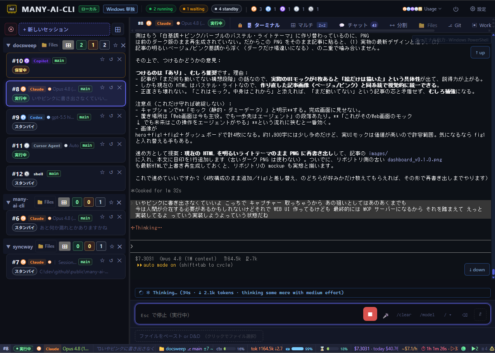

# many-ai-cli




**Không bỏ lỡ thời điểm một AI coding CLI dừng lại — kể cả khi đang dùng điện thoại.** Chạy song song `Claude Code`, `Codex CLI`, `GitHub Copilot CLI`, `Cursor Agent CLI` và `Grok Build CLI`; `many-ai-cli` theo dõi mọi session trong PTY và đẩy thông báo lên desktop hoặc điện thoại ngay khi có session cần đến bạn — prompt phê duyệt, tác vụ hoàn tất hoặc lỗi — không cần canh terminal. Đồng thời cung cấp dashboard Web local để xử lý phê duyệt, giám sát và terminal đa session tại một chỗ.

[English README](README.md) · [日本語版 README](README.ja.md)

> Bản dịch tiếng Việt phục vụ team đọc VI. Khi có mâu thuẫn, ưu tiên [`README.md`](README.md) (English) và mã nguồn.  
> Cập nhật bản dịch: 2026-08-13.

---

## Tổng quan

Khi chạy nhiều AI coding CLI song song trên nhiều terminal, dễ mất dấu session nào đã dừng — phải liên tục kiểm tra. `many-ai-cli` wrap mỗi CLI trong PTY và thông báo desktop/điện thoại ngay khi phát hiện prompt phê duyệt, tác vụ hoàn tất hoặc lỗi. Bạn cũng có thể phê duyệt và theo dõi tiến độ từ **Hub UI** trên trình duyệt. CLI gốc hoạt động như cũ; `many-ai-cli` chỉ bổ sung thông báo và GUI phê duyệt.

**Vai trò này vẫn còn khi việc phê duyệt dần được tự động hóa.** Khi các mô hình quyền như auto mode của Claude Code — chỉ dừng lại ở thao tác không thể hoàn tác hoặc mang tính phá hủy — trở nên phổ biến, prompt phê duyệt sẽ thưa dần. Nhưng chúng không biến mất: session chạy im lặng lâu hơn rồi mới dừng đúng một lần. Khi chạy song song nhiều session, chính lần dừng thưa thớt đó mới là lần dễ bỏ lỡ. Ngoài ra, mô hình phê duyệt khác nhau theo từng CLI và không được tự động hóa đồng thời, nên dùng nhiều nhà cung cấp song song vẫn cần một nơi tập hợp trạng thái. `many-ai-cli` không phải công cụ bấm nút phê duyệt thay bạn, mà là công cụ **phát hiện có thứ gì đó đã dừng và báo cho bạn biết**.

```
Terminal pane #1              Terminal pane #2
┌────────────────────┐        ┌────────────────────┐
│ many-ai-cli claude  │        │ many-ai-cli codex   │
│  (PTY passthrough) │        │  (PTY passthrough) │
└────────┬───────────┘        └────────┬───────────┘
         │ WebSocket                   │ WebSocket
         └─────────────┬───────────────┘
                       ▼
            ┌──────────────────┐
            │ many-ai-cli serve │  http://127.0.0.1:47777
            │  (Hub daemon)    │
            └────────┬─────────┘
                     │
                     ▼
            ┌──────────────────┐
            │  Browser Hub UI  │
            │  approval popover│
            │  session list    │
            └──────────────────┘
```

Mỗi pane có thể chạy provider hỗ trợ — `claude`, `codex`, `copilot`, `cursor-agent`, hoặc `grok` (hình trên chỉ minh họa hai pane).

---

## Provider được hỗ trợ

`many-ai-cli` wrap các AI coding CLI sau trong PTY (cài riêng CLI bạn dùng):

| Provider | Subcommand | Ghi chú |
|---|---|---|
| Claude Code | `claude` | Anthropic |
| Codex CLI | `codex` | OpenAI |
| GitHub Copilot CLI | `copilot` | CLI chính thức; **không** đọc / lưu / proxy OAuth token, PAT hay credential |
| Cursor Agent CLI | `cursor-agent` | CLI chính thức; đăng nhập trước |
| Grok Build CLI | `grok` | Agent terminal chính thức của xAI; đăng nhập trước (cần **SuperGrok** hoặc **X Premium+** — X Premium thường không gồm) |
| opencode | `opencode` | CLI cộng đồng; đăng nhập trước. Thay vì scrape pattern phê duyệt, Hub ghi `opencode.json` (`permission: ask` cho session tương tác, `permission: allow` cho orchestration con) vào cwd session và khôi phục file gốc khi session kết thúc |

**Ollama** không phải wrapper riêng. Chạy model Ollama *qua* wrapper `claude` hoặc `codex` — chọn **Ollama Cloud / Ollama Local** trong model picker form spawn; Hub trỏ endpoint tương thích Anthropic/OpenAI về Ollama (xem mục Features).

Gemini CLI **cố ý ngoài phạm vi**.

---

## Tính năng

- **Panel phê duyệt thống nhất** — approve/reject prompt Claude / Codex / Copilot / Cursor Agent / Grok từ trình duyệt
- **Phê duyệt hàng loạt** — trả lời nhiều câu hỏi đánh số trên một action-bar, submit cùng lúc
- **Output PTY thời gian thực** qua xterm.js + WebSocket
- **Lịch sử chat và Split** — hội thoại kiểu bubble, tìm/lọc, hoặc kề terminal
- **Tab Multi** — lưới nhiều session live, layout cấu hình được
- **Detached Session Grid** — bung session AI/Shell ra cửa sổ trình duyệt riêng dạng lưới; Hub vẫn quản phê duyệt và trạng thái
- **Session shell** — spawn shell tương tác (PowerShell / bash / sh) như session Hub; tắt tính năng AI (inject phê duyệt, Chat, token bar)
- **Tab Files** — duyệt file project, preview Markdown/code, copy path, tạo thư mục, lưu text có phát hiện xung đột, rename/move, xóa thư mục rỗng
- **Tab Git** — lịch sử nhánh, chi tiết commit, file đổi, diff, fetch, `git pull --ff-only`
- **Commit all** — stage toàn working tree và tạo commit local sau bước Review tường minh
- **Light orchestration API** — session conductor spawn session con, chia sẻ `~/.many-ai-cli/orchestration/<id>/board.md`, cô lập worktree git mặc định
- **Đính kèm file/ảnh** — paste hoặc kéo-thả vào session
- **Phím tắt log thô** — từ transcript thô của một session, copy đường dẫn đầy đủ hoặc mở thư mục chứa nó bằng trình quản lý tệp của hệ điều hành
- **Nhập giọng** — nhận dạng trình duyệt hoặc Whisper local; Windows x64 có cài Whisper managed
- **PWA + Web Push opt-in** — cài Hub như web app local; nhận thông báo phê duyệt sau khi bật push trong Settings
- **Profile pattern phê duyệt** — tách cụm trigger official đồng bộ remote với chỉnh sửa custom local
- **User prefs phía server** — voice, âm thông báo, favorites, thứ tự session, mặc định spawn, avatar trong `config.yaml`
- **Spawn session mới** từ UI (`/api/spawn`)
- **Khởi động OpenCode với chế độ bỏ qua phê duyệt** — panel spawn có thể chạy một session OpenCode không cần người trực; phần tóm tắt rủi ro khi spawn sẽ nêu rõ điều đó trước khi bạn xác nhận
- **Cảnh báo binary cũ** — nếu bạn thay file thực thi trong lúc Hub đang chạy, dashboard sẽ báo tiến trình vẫn dùng bản build cũ, thay vì để bạn tự hỏi vì sao bản sửa không có tác dụng
- **Tiến độ workflow theo thời gian thực** — số agent đã xong trên tổng số, thời gian đã trôi qua và cây agent được Hub tính toán rồi hiển thị trên thẻ session và trong màn hình workflow, kèm Web Push tùy chọn khi một lần chạy kết thúc
- **Model picker + định tuyến Ollama** — chọn model Anthropic / OpenAI / Ollama Cloud / Ollama Local; Hub inject `ANTHROPIC_*` / `OPENAI_*` theo session. Daemon Ollama host khác: set `ollama.base_url` trong `config.yaml`

## Light orchestration

`POST /api/sessions/:id/spawn-child` cho phép session conductor tạo session con với role, provider, model, prompt ban đầu và cwd tùy chọn. Hub tạo `~/.many-ai-cli/orchestration/<orchestration_id>/board.md`, inject đường dẫn board vào prompt con, theo dõi tiến độ append và marker `## DONE <role> session=<child_id>`.

Mặc định session con chạy worktree git riêng dưới `.many-ai-cli/worktrees/<orchestration_id>/<role>` khi cwd cha là repo git. Hub **không** auto-merge nhánh con; conductor/người dùng quyết sau khi xem board và nhánh.

Giới hạn đã biết: cơ chế cố ý nhẹ. Board poll 2 giây + inject Enter ngay có thể ngắt lượt conductor đang chạy. Hoàn tất phụ thuộc con ghi `## DONE ...`; không có job DAG, hàng đợi retry, hay merge tự động.

- **Launcher thống nhất (Windows / Linux / macOS)** — `many-ai-cli-launcher` nối Hub theo profile đã lưu và mở trình duyệt: profile SSH `serve` / `tunnel` mọi OS; profile WSL khởi Hub trong WSL trên Windows
- **Tài sản remote server / Docker** — một container Hub / user từ GHCR, publish port chỉ loopback, script auto-update opt-in
- **Transcript sạch** — sinh `.txt` tự động hoặc `log-clean`
- **Đổi ngôn ngữ UI** (English / 日本語 / **Tiếng Việt**) — Settings → Language; file locale `web/src/i18n/{en,ja,vi}.json`
- **UI local-first** — HTTP/WebSocket Hub chỉ bind `127.0.0.1`; bản thân `many-ai-cli` không telemetry
- **Bảo vệ truy cập remote** — Settings → «Remote access protection»: **Thu hồi toàn bộ truy cập** (regenerate token + cookie), **PIN tùy chọn** chỉ khi non-loopback (mặc định tắt, có lockout), **thông báo thiết bị mới**

---

## Yêu cầu

| Hạng mục | Yêu cầu |
|---|---|
| Go | 1.25+ (lúc build) |
| OS | Windows 10/11, macOS, Linux |
| Trình duyệt | Chrome / Edge / Firefox / Safari |
| AI CLI | Claude Code, Codex CLI, GitHub Copilot CLI, Cursor Agent CLI, Grok Build CLI (cài riêng provider cần dùng) |

### Mức xác minh nền tảng

- Đã xác minh thực tế: Hub local Windows và launcher thống nhất Windows (profile `wsl` / SSH tunnel)
- Chưa xác minh đầy đủ thực tế: native Linux, native macOS

Build Linux/macOS được kỳ vọng chạy được nhưng chưa validate đầy đủ — dùng thận trọng và báo issue nếu gặp lỗi.

---

## Tải nhanh

### Cài bằng package manager

**Cài cho developer (npm registry — khuyến nghị):**

```powershell
pnpm add -g many-ai-cli
```

Phương án khác (cùng registry):

```powershell
bun install -g many-ai-cli
npm install -g many-ai-cli
```

Sau cài → [Bắt đầu ngay sau cài](#bắt-đầu-ngay-sau-cài). Nếu shell chưa nhận global bin: `pnpm exec many-ai-cli setup` vẫn tạo shortcut.

> Publish npm từ v0.3.0. Package ship binary Go native theo platform dạng optional dependency — không tải qua trình duyệt; launcher sinh local lúc cài, không dính Mark-of-the-Web (tránh một lớp SmartScreen). **Không** thay Authenticode signing: Smart App Control / WDAC / AppLocker / EDR / AV xử lý riêng. Lệnh global không thấy: `pnpm setup` hoặc mở lại shell để `PATH` có global bin.

**Windows (winget) — dán một dòng:**

```powershell
winget install ishizakahiroshi.many-ai-cli; & "$env:LOCALAPPDATA\Microsoft\WinGet\Links\many-ai-cli.exe" setup
```

> Ngay sau `winget install`, cửa sổ hiện tại chưa có `PATH` mới — gọi `setup` bằng full path shim winget (hoặc mở terminal mới rồi `many-ai-cli setup`).  
> Có khi PR manifest winget đã merge vào `microsoft/winget-pkgs`. Trước đó dùng zip bên dưới.  
> Trên Windows ưu tiên package manager khi có — tránh zip/exe tải trình duyệt mang Mark-of-the-Web. Vẫn không thay code signing / allowlist tổ chức.

**macOS (Homebrew):**

```bash
brew install --cask ishizakahiroshi/tap/many-ai-cli && many-ai-cli setup
```

**Linux — Debian/Ubuntu (.deb) và RHEL (.rpm):**

Tải package từ [GitHub Releases](https://github.com/ishizakahiroshi/many-ai-cli/releases/latest), rồi:

```bash
sudo dpkg -i many-ai-cli_<version>_amd64.deb && many-ai-cli setup   # Debian / Ubuntu
sudo rpm -i many-ai-cli-<version>.x86_64.rpm && many-ai-cli setup   # RHEL family
```

### Tải thủ công (mọi nền tảng)

Lấy bản mới nhất tại [GitHub Releases](https://github.com/ishizakahiroshi/many-ai-cli/releases/latest).

| Nền tảng | File |
|----------|------|
| Windows (x64) | `many-ai-cli-<version>-windows-x64.zip` |
| macOS (Intel) | `many-ai-cli-<version>-macos-intel.zip` |
| macOS (Apple Silicon) | `many-ai-cli-<version>-macos-apple-silicon.zip` |
| Linux (x64) | `many-ai-cli-<version>-linux-x64.zip` |

Giải nén và đặt binary vào `PATH`.

> Cấu hình và log nằm trong `~/.many-ai-cli/` (tạo lần chạy đầu).  
> Session log chứa input người dùng và output AI — **coi là dữ liệu nhạy cảm**.

### Cảnh báo bảo mật Windows

Binary release Windows hiện **chưa** Authenticode-sign.  
`SHA256SUMS.txt` xác minh tính toàn vẹn release, **không** phải code signing cho `.exe`. Windows có thể chặn từ nhiều lớp:

- **Mark-of-the-Web**: zip/exe tải mạng mang dấu internet-zone. Sau giải nén, chạy `unblock-windows.cmd` trong thư mục extract (PowerShell `Unblock-File` chỉ trên `many-ai-cli*.exe` cùng folder; không cần admin; không đổi policy hệ thống; không tự mở app).
- **SmartScreen**: cảnh báo app ít gặp / publisher lạ. Chỉ tiếp tục nếu bạn cố ý tải release và đã kiểm checksum/chữ ký khi cần.
- **Smart App Control**: một số Windows 11 chặn hẳn app chưa ký. `unblock-windows.cmd` **không** vượt được.
- **Policy tổ chức**: AppLocker, WDAC, EDR, AV… — theo quy trình allowlist công ty, **không** tắt control.

Khi có winget, ưu tiên winget hơn zip. Zip thủ công vẫn hỗ trợ khi cần artifact trực tiếp.  
Hub chỉ bind `127.0.0.1` — dùng local thường **không** cần mở firewall LAN/public.

Luồng zip Windows khuyến nghị:

1. Tải `many-ai-cli-<version>-windows-x64.zip` từ Releases  
2. Xác minh `SHA256SUMS.txt` / cosign nếu yêu cầu  
3. Giải nén  
4. Chạy `unblock-windows.cmd`  
5. Khởi động `many-ai-cli.exe` hoặc `many-ai-cli-launcher.exe` thủ công  

#### Double-click `many-ai-cli.exe` (không khuyến nghị)

> Zip/exe từ trình duyệt là trigger chính Mark-of-the-Web / SmartScreen. Khi có thể, dùng package manager + `many-ai-cli setup`.

Nếu vẫn dùng exe từ zip:

1. Giải nén; chạy `unblock-windows.cmd` nếu cần  
2. **Double-click `many-ai-cli.exe`** (hoặc `many-ai-cli` không đối số) — Hub start, trình duyệt mở `http://127.0.0.1:47777/?token=<token>`; nếu Hub đã chạy thì mở lại instance hiện có  
3. Trên Hub UI, **"+ New Session"** để launch session wrap  
4. Dừng cố ý: nút `⏻` góc phải Hub UI, hoặc `many-ai-cli stop` từ terminal khác  

### Xác minh artifact release (checksum + chữ ký)

Từ `v0.1.2` trở đi release gồm `SHA256SUMS.txt`, `SHA256SUMS.txt.sig`, `SHA256SUMS.txt.pem`.

```bash
cosign verify-blob \
  --certificate SHA256SUMS.txt.pem \
  --signature SHA256SUMS.txt.sig \
  --certificate-identity-regexp "https://github.com/ishizakahiroshi/many-ai-cli/.github/workflows/release.yml@refs/tags/v.*" \
  --certificate-oidc-issuer "https://token.actions.githubusercontent.com" \
  SHA256SUMS.txt

sha256sum -c SHA256SUMS.txt
```

---

## Bắt đầu ngay sau cài

Mọi đường cài đều chung các bước sau.

1. Chạy **một lần**:

   ```
   many-ai-cli setup
   ```

   Tạo shortcut desktop **"Many AI Hub Start"** và **"Many AI Hub Stop"** (`.lnk` Windows, `.command` macOS, `.desktop` Linux).
2. Sau đó chỉ **double-click "Many AI Hub Start"**. Console + trình duyệt mở `http://127.0.0.1:47777/?token=<token>`.
3. Trên Hub UI, **"+ New Session"** (góc dưới trái) để launch CLI wrap (claude / codex / copilot / cursor-agent / opencode / grok). Khi có phê duyệt, action-bar hiện dưới ô nhập — bấm nút hoặc phím.

Dừng: **"Many AI Hub Stop"**, nút `⏻` Hub UI, hoặc `many-ai-cli stop`. Terminal: `many-ai-cli serve --open` vẫn dùng được.

> **⚠ Về cửa sổ console**  
> "Many AI Hub Start" mở console **chính là process Hub** — đóng `×` = tắt Hub. Lấn màn hình thì **minimize**, đừng đóng.  
> Hub down (× / crash / restart tay): session AI chờ tới **60 phút** Hub trở lại trước khi tự thoát (cấu hình `config.yaml` tối đa 24 giờ — kéo dài cho task tự vận hành dài). Bug/restart Web UI không âm thầm giết việc. Xem mục resilience trong README English.  
> Linux (GNOME): lần đầu dùng `.desktop` trên desktop, chuột phải → **"Allow Launching"**.

### Launcher thống nhất (Windows / Linux / macOS)

`many-ai-cli-launcher` (`many-ai-cli-launcher.exe` trên Windows) quản profile kết nối WSL và remote server. Profile lưu `~/.many-ai-cli/launcher-profiles.yaml`.

Binary launcher ship mọi platform. Profile `ssh` (`serve` / `tunnel`) chạy Windows/Linux/macOS; profile `wsl` **chỉ Windows** (OS khác báo lỗi rõ). Linux mở browser bằng `xdg-open`, macOS bằng `open`.

#### Cách hoạt động

| Type | Use case |
|---|---|
| `wsl` | Start `many-ai-cli serve` trong WSL, mở từ browser Windows (chỉ Windows) |
| `ssh` | Nối máy remote qua SSH (mọi OS) |

| Mode SSH | Use case |
|---|---|
| `serve` | SSH vào remote và start `many-ai-cli serve` phía remote |
| `tunnel` | Port-forward tới Hub đã chạy remote (systemd / tmux / Docker compose, …) |

Cả hai mode: Hub remote vẫn chỉ bind `127.0.0.1`. SSH local forward (`-L 127.0.0.1:<port>:127.0.0.1:<port>`) cho browser local tới được mà **không** expose Hub ra mạng.

Profile `wsl` gọi `wsl.exe` start binary Linux trong WSL; khi Linux in URL Hub, browser Windows mặc định mở. Shell `bash -ilc` (login + interactive) nên `~/.bashrc` (`nvm`, `pnpm`, `cargo`, …) load đủ. Xung đột port Windows (ví dụ `many-ai-cli.exe` giữ 47777) → launcher chọn port kế tiếp.

#### Cấu hình mẫu

```yaml
version: 1
profiles:
  - name: my-wsl
    type: wsl
    distro: Ubuntu-22.04  # bỏ trống = distro WSL mặc định
    hub_port: 0           # 0 = tự chọn tránh đụng Windows

  - name: my-remote
    type: ssh
    mode: serve
    host: remote.example.com
    user: your-user
    hub_port: 47777

  - name: remote-docker
    type: ssh
    mode: tunnel
    host: remote.example.com
    user: your-user
    hub_port: 47801
    token_command: "docker exec many-ai-cli-user1 sh -c 'grep ^token ~/.many-ai-cli/config.yaml | cut -d\" \" -f2'"
```

#### Tiên quyết profile WSL: binary Linux trong WSL

```bash
unzip many-ai-cli-<version>-linux-x64.zip
mkdir -p ~/.local/bin
mv many-ai-cli ~/.local/bin/many-ai-cli
chmod +x ~/.local/bin/many-ai-cli
# đảm bảo ~/.local/bin trong PATH
many-ai-cli --version
```

#### Tunnel mode: setup end-to-end (tóm tắt)

**A. Phía remote (một lần):** đặt binary Linux; `many-ai-cli serve --port 47777` (port **cố định** — tunnel không cho auto-select); giữ resident (systemd/tmux/Docker). Token lần đầu trong `~/.many-ai-cli/config.yaml`. Chuẩn bị `token_command` in ra token (ví dụ `awk '/^token:/{print $2}' ~/.many-ai-cli/config.yaml`).

**B. Phía client (một lần):** SSH **key-based** (`BatchMode=yes` — password không dùng được). Tạo profile type `ssh` mode `tunnel` với `hub_port` khớp và `token_command`.

**C. Hàng ngày:** start launcher → chọn profile → tunnel + token + mở browser. Xong việc đóng launcher chỉ rớt tunnel; session remote vẫn chạy. Lần sau reconnect cùng profile.

**Bẫy thường gặp:** lệch port serve vs `hub_port`; password prompt (BatchMode fail); `token_command` rỗng (Hub chưa start lần nào); Docker phải publish Hub ra `127.0.0.1` host.

#### Launch

```powershell
many-ai-cli-launcher.exe
many-ai-cli-launcher.exe --profile my-remote
many-ai-cli-launcher.exe --last
many-ai-cli-launcher.exe --ui
```

#### Bảo mật launcher

- Hub chỉ `127.0.0.1` — không `0.0.0.0`, không reverse proxy public  
- Forward chỉ local `127.0.0.1`↔`127.0.0.1` (không `-g` / `GatewayPorts`)  
- Không lưu password / passphrase; bắt buộc key auth  
- Token từ `token_command` chỉ dùng phiên hiện tại, **không** ghi vào `launcher-profiles.yaml`  

Chi tiết schema: [docs/v0.3.x-many-ai-cli-design.md — §13](docs/v0.3.x-many-ai-cli-design.md).

#### Windows chặn launcher: remote không cần `.exe` local

SmartScreen / policy chặn `many-ai-cli-launcher.exe` vẫn nối Hub remote bằng:

- OpenSSH client Windows (`ssh.exe`)
- Trình duyệt thường
- Binary Linux / Docker `many-ai-cli` trên server

Đổi lại: giữ một cửa sổ tunnel SSH mở, rồi mở URL Hub trên browser.

**Đường tránh dialog SmartScreen**

- **Nút 🖥 Server trên Hub** — `many-ai-cli serve`, bấm **🖥 Server** header: quản profile, connect/disconnect; SSH/WSL child do Hub giữ, không cần console phụ.  
- **`many-ai-cli connect`** — `many-ai-cli connect --profile <name>` hoặc `--last`: cùng flow launcher từ terminal.

Mark-of-the-Web: `unblock-windows.cmd` / `Unblock-File`. Nếu Defender quarantine (false positive Go binary) cần signing / exclusion / báo FP — không chỉ Unblock.

**Cái gì lưu ở đâu**

| Mục | Lưu tại | Ghi chú |
|---|---|---|
| SSH host, user, key path | Windows `%USERPROFILE%\.ssh\config` | SSH config thường |
| Hub token | Remote `~/.many-ai-cli/config.yaml` | Không dán chat/issue/screenshot public |
| Prefs Hub, favorites, spawn defaults | Remote `config.yaml` | Sống qua reconnect |
| Log & attachment | Remote `logs/`, `attachments/` | Không trên PC Windows |
| Working repo | Filesystem remote | Hub sửa file remote |

**Tunnel SSH tay (PowerShell):**

```powershell
ssh -N -T `
  -o ExitOnForwardFailure=yes `
  -o ServerAliveInterval=30 `
  -L 127.0.0.1:47777:127.0.0.1:47777 `
  remote-host
```

Browser: `http://127.0.0.1:47777/?token=<token-từ-remote>` — **không** thay bằng IP public remote.

Chi tiết full (tmux, firewall, `.cmd` shortcut, pitfall): xem [`README.md`](README.md) mục tương ứng hoặc [manual remote](docs/manual_remote-server-overview.vi.md).

---

## Dùng từ điện thoại (iPhone / Android)

> **Ghi chú (beta / draft)** — UI điện thoại preview trong v0.3.x. Layout, tương tác, thông báo có thể đổi. Feedback qua GitHub Issues.

Hub UI mobile-ready (responsive, nút chạm, panel phím Esc/Ctrl/mũi tên, PWA). Vì Hub chỉ `127.0.0.1`, điện thoại **không** mở bằng IP LAN PC — **đúng by design**. Dùng cùng pattern remote PC: **SSH local forward** trỏ `127.0.0.1` của điện thoại về Hub. Không public; không hỗ trợ public.

**Cần trên điện thoại:** app SSH có local port forward (vd. [Termius](https://termius.com/)) + trình duyệt.

### A. PC nhà cùng Wi-Fi

1. Bật OpenSSH Server trên PC chạy Hub  
2. Termius: host = IP LAN PC, user PC; key auth khuyến nghị  
3. Port Forwarding: Local `127.0.0.1:47777` → `127.0.0.1:47777`  
4. Mở tunnel → browser `http://127.0.0.1:47777/?token=<token>`  
5. Share → **Add to Home Screen** (PWA)  

### B. Remote server

Giống A với host Termius = remote. Nhiều Hub: **mỗi đích một port listen phía điện thoại** (tránh share origin PWA/localStorage/token).

| Đích | URL phía điện thoại | Local forward Termius |
|---|---|---|
| PC nhà | `http://127.0.0.1:47777/?token=<PC>` | `47777` → `127.0.0.1:47777` |
| Remote | `http://127.0.0.1:47778/?token=<remote>` | `47778` → remote `127.0.0.1:47777` |

Hub vẫn 47777 phía server; chỉ port listen phone khác. **Không** tái sử dụng một port phone cho hai Hub.

### Ghi chú mobile

- iOS suspend app nền → tunnel Termius rớt; session vẫn chạy host; mở lại Termius + PWA tiếp tục.  
- Web Push (đã bật) có thể tới khi tunnel down — **mở Hub từ noti vẫn cần tunnel**.  
- Token đổi khi Hub restart; 403 → lấy token mới.  

### Thông báo phê duyệt không cần tunnel (ntfy / webhook)

Web Push cần subscription browser sống. **ntfy** là push HTTP outbound — Hub POST server ntfy, app điện thoại nhận; **không** cần tunnel persistent.

1. Cài [ntfy](https://ntfy.sh/) trên điện thoại  
2. Hub Settings → **ntfy / webhook notification** → Configure  
3. **+ Add ntfy**; URL `https://ntfy.sh` (hoặc self-host)  
4. **Generate** topic ngẫu nhiên → **Save**  
5. App ntfy subscribe cùng topic  
6. **Send test**  
7. Tick **Approval** dưới Events  

Token Hub **không** nằm trong payload ntfy. Topic = shared secret — dùng chuỗi dài ngẫu nhiên (nút Generate).

Webhook generic: **+ Add webhook**, URL nhận `POST` JSON `{"title":"...","body":"..."}` (Discord / Slack / relay tùy chỉnh).

Hướng dẫn bảo mật mobile đầy đủ: [docs/manual_mobile-access.vi.md](docs/manual_mobile-access.vi.md).

---

## Khởi động từ terminal (nâng cao)

### A. Provider là subcommand

```bash
many-ai-cli claude
many-ai-cli codex
many-ai-cli copilot
many-ai-cli cursor-agent
many-ai-cli grok
```

Không cần `serve` trước — auto-start Hub nền nếu thiếu.

### B. `wrap` (debug)

```bash
many-ai-cli wrap claude   # tương đương A, tường minh lớp wrapper
```

### C. Chế độ trong suốt (`MANY_AI_CLI_AUTO`)

```bash
eval "$(many-ai-cli shell-init)"   # bash / zsh only
export MANY_AI_CLI_AUTO=1
claude   # đi qua wrapper
```

Không set `MANY_AI_CLI_AUTO=1` thì lệnh gốc nguyên vẹn. Không sửa `.bashrc` global.

Copilot / Cursor / Grok: chỉ wrap CLI official trong PTY; **không** đọc/lưu/proxy credential.

**PowerShell** (`shell-init` không hỗ trợ PS) — thêm vào `$PROFILE`:

```powershell
if ($env:MANY_AI_CLI_AUTO -eq '1') {
    function claude { many-ai-cli claude @args }
    function codex  { many-ai-cli codex  @args }
    function copilot { many-ai-cli copilot @args }
    function cursor-agent { many-ai-cli cursor-agent @args }
    function grok { many-ai-cli grok @args }
}
```

---

## Subcommand

| Lệnh | Mô tả |
|---|---|
| `serve [--open] [--port N]` | Start Hub; `--open` mở browser |
| `connect --profile <name> \| --last` | Nối Hub remote từ terminal (tránh SmartScreen launcher `.exe`) |
| `claude` / `codex` / `copilot` / `cursor-agent` / `grok` / `opencode` | Launch provider qua Hub |
| `wrap <provider>` | Wrap tùy ý (debug) |
| `shell-init` | In snippet function shell (transparent mode) |
| `setup` | Tạo shortcut desktop Start/Stop |
| `doctor` | Chẩn đoán môi trường |
| `status` | Hub có đang chạy không |
| `stop` | Dừng Hub |
| `log-clean <session.jsonl>` | Sinh transcript sạch |
| `uninstall [--purge]` | Gỡ settings/log; `--purge` cả binary |
| `profile-export` | Export profile kết nối (server) |
| `version` | In phiên bản |

---

## Hub UI

Mở `http://127.0.0.1:47777/?token=<token>`.

### Bố cục (tóm tắt)

- **Header**: chip `[running][waiting][standby]`, đếm theo provider; `⏻` dừng Hub; Settings.  
- **Sidebar trái**: `+ New Session`; session nhóm theo project folder; pin / đóng / state badge / branch / last response.  
- **Pane phải**: terminal xterm.js + ô nhập + attach + slash picker.  
- **Tab**: Terminal, Chat, Split, Multi, Files, Git (Files/Git lazy).  
- **Action-bar phê duyệt** phía trên input khi chờ; multi-question có Submit all.  
- **Status bar đáy**: token, cost, context, burn rate, fleet badge (tắt/bật trong Settings).  

### Phím tắt

| Phím | Hành động |
|-----|--------|
| `Enter` | Gửi |
| `Shift+Enter` | Xuống dòng |
| `Tab` / `Shift+Tab` | Session kế / trước |
| `←` / `→` | Focus nút action-bar (input rỗng) |
| `Alt+V` | Bật/tắt voice |
| `Ctrl+Shift+G` | Tab Git |
| `Ctrl+Shift+F` | Tab Files |
| `Ctrl+V` | Paste ảnh vào attach |
| `Ctrl+C` | SIGINT PTY (hoặc copy) |
| `Ctrl+D` | EOF PTY |
| `Ctrl+O` | Mở rộng nội dung gập Claude Code |

---

## Nhập liệu giọng

- **Whisper (local)** — audio không rời máy (khi `server_url` trỏ `127.0.0.1` / `localhost`).  
- **Browser** — Web Speech API; **audio gửi Google/Microsoft**. Nhanh, chính xác.  
- **Điện thoại** — IME / voice OS (cũng cloud như Browser; thường mượt trên mobile).  

Quy tắc ngắn: không muốn audio rời máy → Whisper; ưu tiên tiện/chính xác → Browser hoặc IME điện thoại.

Chi tiết cài Whisper: [docs/manual_whisper.vi.md](docs/manual_whisper.vi.md).

---

## Cấu hình

| OS | Path |
|---|---|
| Windows | `%USERPROFILE%\.many-ai-cli\config.yaml` |
| macOS / Linux | `~/.many-ai-cli/config.yaml` |

```yaml
hub:
  port: 47777
  open_browser: false
  auto_shutdown: true
  log_dir: ""               # rỗng = ~/.many-ai-cli/logs
  idle_timeout_min: 60
  wrapper_reconnect_grace_sec: 3600  # 0–86400

ollama:
  base_url: ""              # rỗng = http://localhost:11434

voice:
  whisper:
    managed: false
    model: "small"
    server_url: ""
    server_port: 0
    request_path: ""
    language: "ja"
    timeout_seconds: 60

log:
  enabled: true
  max_size_mb: 10
  max_backups: 3
  compress: false

token: ""                   # rỗng = sinh ngẫu nhiên lúc start
```

Reset token: xóa dòng `token:` và restart Hub.

`ollama.base_url` là endpoint daemon Ollama **nhìn từ process Hub** (Hyper-V / WSL / Docker / host-guest đều được nếu HTTP tới được). Model picker đọc `<base_url>/api/tags`; session Claude Ollama nhận `ANTHROPIC_BASE_URL=<base_url>`; Codex Ollama nhận `OPENAI_BASE_URL=<base_url>/v1`. **Không** gắn `/v1` hay `/api/tags` vào `base_url`.

### Ba nhóm lưu settings

| Nhóm | Ví dụ | Lưu |
|---|---|---|
| **D1: UI display** (per-device) | theme, font, language, sidebar width | **localStorage** trình duyệt |
| **D2: Feature user** (chia device/port) | voice, trigger, âm, favorites, spawn defaults | `config.yaml` → `user_prefs:` qua `/api/user-prefs` |
| **D3: Vận hành server** | port, log, approval on/off, slash sources, token | `config.yaml` |

Ngoại lệ: engine voice (`off`/`browser`/`whisper`) ở localStorage từng trình duyệt.

---

## Chuyển ảnh

1. `many-ai-cli serve` + mở Hub UI  
2. Chọn session card  
3. Paste `Ctrl+V` / kéo-thả vùng attach / click chọn file  
4. Hub lưu `~/.many-ai-cli/attachments/<session-id>/` và inject path:  
   - Claude: `@<path>`  
   - Codex: `<path>`  

---

## Resilience: shutdown, zombie, Hub crash

- **Tắt có chủ đích** (nút `×` session, «dừng tất cả», idle timeout khi Hub HTTP còn sống): PTY con **thoát ngay**, không grace.  
- **Hub crash / restart / đóng console**: wrapper chờ `wrapper_reconnect_grace_sec` (mặc định 3600s) rồi reattach — **không** mất session AI vì UI lỗi/restart trong cửa sổ grace. Task dài: tăng tới tối đa 86400.  

Dừng sạch: `⏻` UI hoặc `many-ai-cli stop`.

---

## Bảo mật / quyền riêng tư (tóm tắt)

- Bind `127.0.0.1` only; token trên URL.  
- Không telemetry từ many-ai-cli; có thể HTTPS GitHub khi fetch slash-commands / approval-patterns / models.  
- Session log **opt-in** (`log.session_enabled`) — raw log có thể chứa secret hiện trên terminal.  
- Remote: SSH/VPN do người dùng; xem [manual mobile](docs/manual_mobile-access.vi.md).  

---

## Remote / Docker

- Mục lục vai trò A/B/C và chọn quy trình: [docs/manual_remote-server-overview.vi.md](docs/manual_remote-server-overview.vi.md)  
- Agent server đơn / Docker: file gốc `docs/manual_remote-server-agent-*.md`  
- SSH tunnel chi tiết: `docs/manual_remote-server-ssh-tunnel.md`  

---

## Tài liệu tiếng Việt trong repo

Mục lục đầy đủ: **[docs/README.vi.md](docs/README.vi.md)** (tất cả `manual_*.vi.md`).

| File | Nội dung |
|---|---|
| [README.vi.md](README.vi.md) | File này |
| [CLAUDE.vi.md](CLAUDE.vi.md) | Hướng dẫn phát triển (từ CLAUDE.md) |
| [docs/README.vi.md](docs/README.vi.md) | Mục lục manual VI |
| `docs/manual_*.vi.md` | Toàn bộ manual vận hành (remote, Docker, Whisper, release, …) |
| `web/src/i18n/vi.json` | Locale Hub UI (Settings → Language → Tiếng Việt) |

Các phần README English rất dài (launcher full, status bar chi tiết, image transfer edge case, disclaimer đầy đủ) giữ chuẩn tại [`README.md`](README.md). Bản VI ưu tiên **đủ để onboard team**; chi tiết edge-case tra bản English.

---

## Giấy phép

MIT. Xem `LICENSE` và `THIRD_PARTY_NOTICES.md`.

## Miễn trừ trách nhiệm

Phần mềm cung cấp «as is», không bảo đảm. Người dùng chịu trách nhiệm cấu hình remote/VPN/SSH và dữ liệu nhạy cảm trong log.
